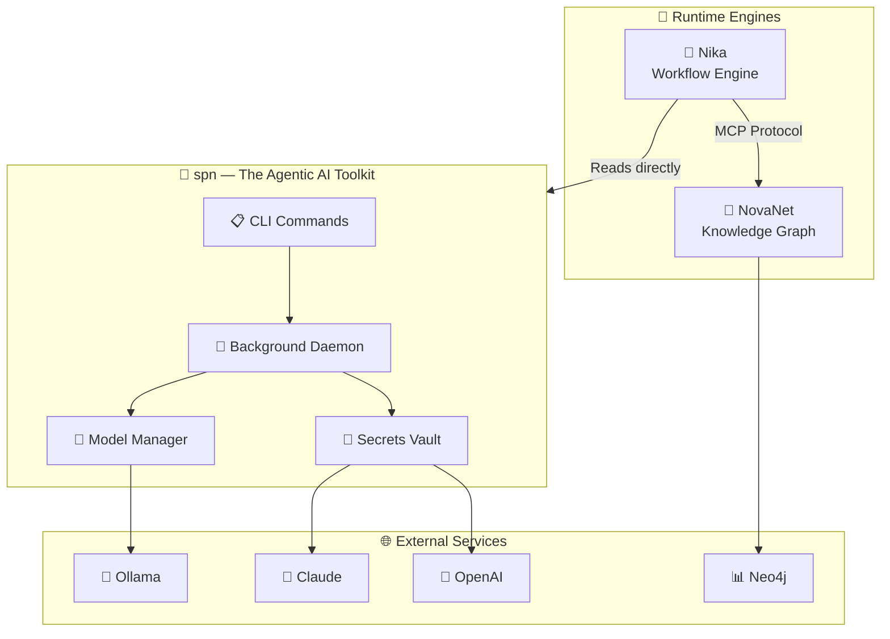

<div align="center">

<!-- SuperNovae ASCII Logo -->
```
        ✦                                              ✦
     ✧  ███████╗██████╗ ███╗   ██╗    ██████╗██╗     ██╗  ✧
     ·  ██╔════╝██╔══██╗████╗  ██║   ██╔════╝██║     ██║  ·
        ███████╗██████╔╝██╔██╗ ██║   ██║     ██║     ██║
     ·  ╚════██║██╔═══╝ ██║╚██╗██║   ██║     ██║     ██║  ·
     ✧  ███████║██║     ██║ ╚████║   ╚██████╗███████╗██║  ✧
        ╚══════╝╚═╝     ╚═╝  ╚═══╝    ╚═════╝╚══════╝╚═╝
        ✦                                              ✦
```

# The Agentic AI Toolkit

**Your complete AI development environment in one command.**

<sub>Local models • Cloud providers • MCP servers • Secrets • Workflows • Autonomous agents</sub>

---

<!-- Badges -->
[](https://crates.io/crates/spn-cli)
[](https://ghcr.io/supernovae-st/spn)
[](LICENSE)
[](https://github.com/supernovae-st/supernovae-cli/actions)

<!-- Quick Links -->
<p>
<a href="#-quick-start">Quick Start</a> •
<a href="#-why-spn">Why spn?</a> •
<a href="#-installation">Install</a> •
<a href="#-features">Features</a> •
<a href="#-roadmap">Roadmap</a> •
<a href="#-contributing">Contribute</a>
</p>

</div>

---

## Three Commands to AI Mastery

```bash
# 1. Download a local model (100% private, no API keys)
spn model pull llama3.2:1b

# 2. Add an MCP server for knowledge graph access
spn mcp add neo4j

# 3. Check your AI environment status
spn status
```

**That's it.** You now have:
- A running local LLM (via Ollama)
- A knowledge graph connection (via Neo4j MCP)
- Unified credential management (via OS Keychain)
- Ready for Claude, GPT, or any LLM provider

---

## Why spn?

<table>
<tr>
<td width="50%">

### The Problem

Building with AI today means juggling:
- 🔑 API keys scattered across `.env` files
- 🔌 MCP servers configured separately per editor
- 🦙 Local models managed in isolation
- 📋 Workflows lost in script chaos
- 🤖 No orchestration between tools

**Result:** Hours wasted on setup, zero time building.

</td>
<td width="50%">

### The Solution

**spn** unifies your entire AI stack:
- 🔐 **One keychain** for all credentials
- 🔌 **One config** for all MCP servers
- 🦙 **One CLI** for all models
- 📋 **One format** for all workflows
- 🤖 **One daemon** for orchestration

**Result:** 5 minutes to production, forever productive.

</td>
</tr>
</table>

---

## Installation

<details open>
<summary><b>🍺 Homebrew (Recommended for macOS/Linux)</b></summary>

```bash
brew install supernovae-st/tap/spn
```

</details>

<details>
<summary><b>🦀 Cargo (Cross-platform)</b></summary>

```bash
cargo install spn-cli
```

</details>

<details>
<summary><b>🐳 Docker (Containerized)</b></summary>

```bash
# Run directly
docker run --rm ghcr.io/supernovae-st/spn:latest --version

# With project mount
docker run --rm -v $(pwd):/workspace ghcr.io/supernovae-st/spn:latest status
```

> Docker images are ~5MB (scratch-based), support amd64/arm64, and include CA certificates.

</details>

<details>
<summary><b>📦 Pre-built Binaries</b></summary>

Download from [GitHub Releases](https://github.com/supernovae-st/supernovae-cli/releases/latest):
- macOS (Apple Silicon + Intel)
- Linux (x86_64 + ARM64)
- Windows (coming soon)

</details>

### Verify Installation

```bash
spn --version  # spn-cli 0.15.5
spn doctor     # Health check
```

---

## Quick Start

### 1. Interactive Setup Wizard

```bash
spn setup
```

The wizard will:
- Detect existing API keys and offer to migrate them
- Show you where to get new API keys (with links)
- Configure your preferred providers
- Set up MCP servers
- Sync to your editors (Claude Code, Cursor, Windsurf)

### 2. Use Local Models (Zero API Keys)

```bash
# Pull a model from Ollama registry
spn model pull llama3.2:1b

# Load it into memory
spn model load llama3.2:1b

# Check what's running
spn model status
```

### 3. Add Cloud Providers

```bash
# Store API keys securely in OS Keychain
spn provider set anthropic
spn provider set openai

# Test them
spn provider test all
```

### 4. Add MCP Servers

```bash
# Add from 48 built-in aliases
spn mcp add neo4j          # Knowledge graph
spn mcp add github         # Code integration
spn mcp add perplexity     # AI search

# Test connection
spn mcp test neo4j
```

### 5. Check Your Environment

```bash
spn status
```

**Output:**
```
┏━━━━━━━━━━━━━━━━━━━━━━━━━━━━━━━━━━━━━━━━━━━━━━━━━━━━━━━━━━━━━━━━━━━━━━━━━━━━━━┓
┃  ✦ spn status                                    The Agentic AI Toolkit  ✦  ┃
┗━━━━━━━━━━━━━━━━━━━━━━━━━━━━━━━━━━━━━━━━━━━━━━━━━━━━━━━━━━━━━━━━━━━━━━━━━━━━━━┛

┌─ 🦙 LOCAL MODELS ────────────────────────────────────────────────────────────┐
│  Ollama → http://localhost:11434                            ✅ running        │
│  Memory  2.1 / 16.0 GB                    ████░░░░░░░░░░░░  13%              │
│  Models                                                                      │
│  ├── ● llama3.2:1b          1.2 GB  ← active                                 │
│  └── ○ mistral:7b           4.1 GB                                           │
└──────────────────────────────────────────────────────────────────────────────┘

┌─ 🔑 CREDENTIALS ─────────────────────────────────────────────────────────────┐
│  Name          Type   Status      Source      Endpoint                       │
│  anthropic     LLM    ✅ ready     🔐 keychain api.anthropic.com             │
│  openai        LLM    ✅ ready     📦 env      api.openai.com                 │
│  ollama        LLM    ✅ local     🦙 local    localhost:11434                │
│  neo4j         MCP    ✅ ready     🔐 keychain bolt://localhost:7687          │
│  7/13 configured   │   🔐 2 keychain   📦 4 env   🦙 1 local                  │
└──────────────────────────────────────────────────────────────────────────────┘

┌─ 🔌 MCP SERVERS ─────────────────────────────────────────────────────────────┐
│  Server        Status      Transport   Command             Credential         │
│  neo4j         ○ ready     stdio       uvx                 → neo4j            │
│  perplexity    ○ ready     stdio       npx                 → perplexity       │
│  3/3 active                                                                   │
└──────────────────────────────────────────────────────────────────────────────┘

  🔑 7/13 Keys    🔌 3 MCPs    🦙 2 Models    📡 Daemon OK
```

---

## Features

### 🦙 Local Model Management

Run LLMs locally with **zero API costs** and **100% privacy**.

```bash
spn model pull llama3.2:1b     # Download from Ollama registry
spn model load llama3.2:1b     # Load into GPU/RAM
spn model status               # Check VRAM usage
spn model list                 # List installed models
```

**Supported:** All Ollama models (70+ including Llama, Mistral, CodeLlama, Gemma)

### 🔐 Secure Credential Management

Store API keys in your **OS-native keychain** with military-grade security.

```bash
spn provider set anthropic     # Interactive prompt (hidden input)
spn provider list              # Show all keys (masked)
spn provider migrate           # Move .env → keychain
spn provider test all          # Validate all keys
```

**Security Stack:**
- 🔒 OS Keychain (macOS/Windows/Linux native)
- 🧠 Memory protection (`mlock`, `MADV_DONTDUMP`)
- 🗑️ Auto-zeroization (`Zeroizing<T>`)
- 🚫 No debug/display exposure (`SecretString`)

**Supported Providers:**
- **LLM:** Anthropic, OpenAI, Mistral, Groq, DeepSeek, Gemini, Ollama
- **MCP:** Neo4j, GitHub, Slack, Perplexity, Firecrawl, Supadata

### 🔌 MCP Server Management

Configure once, use everywhere. No per-editor setup.

```bash
spn mcp add neo4j              # From 48 built-in aliases
spn mcp add github --global    # User-level server
spn mcp list                   # Show all configured
spn mcp test neo4j             # Verify connection
spn sync                       # Push to editors
```

**Built-in Aliases (48):**
- **Database:** neo4j, postgres, sqlite, supabase
- **Dev Tools:** github, gitlab, filesystem
- **Search/AI:** perplexity, brave-search, tavily
- **Web:** firecrawl, puppeteer, playwright
- **Communication:** slack, discord

### 📊 Unified Status Dashboard

One command to see your **entire AI environment**.

```bash
spn status           # ASCII dashboard
spn status --json    # Machine-readable
```

**Shows:**
- 🦙 Local models (installed, loaded, VRAM)
- 🔑 Credentials (source, status, endpoint)
- 🔌 MCP servers (status, transport, command)
- 📡 Daemon (PID, socket, uptime)

### 🤖 Agent Orchestration (v0.15.0)

Run autonomous AI agents that delegate tasks, reason, and learn.

```bash
spn jobs submit workflow.yaml  # Submit background workflow
spn jobs list                  # Show running jobs
spn jobs logs <id>             # Stream logs
spn suggest                    # Context-aware suggestions
```

**Features:**
- 📋 Background job scheduler
- 🧠 Cross-session memory
- 🤖 Multi-agent delegation
- 🔮 Autonomy orchestration
- 💡 Proactive suggestions

### 🎯 Three-Level Config System

Configuration that scales from solo dev to enterprise.

```
🌍 Global (~/.spn/config.toml)
    ↓
👥 Team (./mcp.yaml, committed to git)
    ↓
💻 Local (./.spn/local.yaml, gitignored)
    ↓
⚙️ Resolved (Local > Team > Global)
```

```bash
spn config show               # View resolved config
spn config get providers.anthropic.model
spn config set providers.anthropic.model claude-opus-4
spn config where              # Show file locations
```

### 🔄 Universal Editor Sync

Configure once, sync to **all your editors**.

```bash
spn sync                      # Sync to all enabled
spn sync --target claude-code # Sync to one
spn sync --interactive        # Preview changes
spn sync --enable cursor      # Enable auto-sync
```

**Supported Editors:**
- Claude Code (`.claude/settings.json`)
- Cursor (`.cursor/mcp.json`)
- Windsurf (`.windsurf/mcp.json`)

### 🛠️ Dynamic REST-to-MCP Wrapper

Turn any REST API into an MCP server.

```bash
spn mcp wrap --from-openapi swagger.json --output server.yaml
spn mcp add ./server.yaml
```

**Features:**
- OpenAPI 3.0 parsing
- Rate limiting
- Authentication handling
- MCP Resources support

---

## Roadmap

```
┌─────────────────────────────────────────────────────────────────────────────────┐
│  SPN EVOLUTION — v0.15 to v0.18 (2026 Q1-Q2)                                    │
├─────────────────────────────────────────────────────────────────────────────────┤
│                                                                                 │
│  ✅ Phase A (v0.16.0) — UNIFIED BACKEND REGISTRY                                │
│     • @models/ aliases in spn.yaml                                              │
│     • Cloud providers as backends                                               │
│     • Intent-based model selection                                              │
│     • Backend orchestration system                                              │
│                                                                                 │
│  📋 Phase B (v0.17.0) — MULTIMODAL BACKENDS                                     │
│     • Candle (HuggingFace models)                                               │
│     • mistral.rs (vision models)                                                │
│     • Image generation/analysis                                                 │
│     • Speech-to-text, text-to-speech                                            │
│                                                                                 │
│  🧠 Phase C (v0.17.5) — HARDWARE-AWARE RECOMMENDATIONS                          │
│     • llmfit-core integration                                                   │
│     • System resource detection                                                 │
│     • Model scoring based on hardware                                           │
│     • Automatic fallback strategies                                             │
│                                                                                 │
│  🤖 Phase D (v0.18.0) — REASONING MODELS                                        │
│     • OpenAI o1/o3 support                                                      │
│     • DeepSeek-R1 support                                                       │
│     • Reasoning trace capture                                                   │
│     • Anthropic extended thinking                                               │
│                                                                                 │
│  🔮 Phase E (v0.18.5) — AGENTIC CAPABILITIES                                    │
│     • Nested agent spawning                                                     │
│     • Schema introspection                                                      │
│     • Dynamic task decomposition                                                │
│     • Lazy context loading                                                      │
│                                                                                 │
│  🚀 Phase F (v0.19.0) — MCP AUTO-SYNC                                           │
│     • File system monitoring                                                    │
│     • Foreign MCP detection                                                     │
│     • Desktop notifications                                                     │
│     • Automatic adoption/sync                                                   │
│                                                                                 │
└─────────────────────────────────────────────────────────────────────────────────┘
```

**Current:** v0.15.5 (Phase A in progress)

---

## Architecture

```
┌─────────────────────────────────────────────────────────────────────────────────┐
│  6-CRATE WORKSPACE                                                              │
├─────────────────────────────────────────────────────────────────────────────────┤
│                                                                                 │
│  spn-core (0.1.2)     Zero-dependency types, provider registry, validation     │
│       ↓                                                                         │
│  spn-keyring (0.1.4)  OS keychain wrapper, memory protection                   │
│       ↓                                                                         │
│  spn-client (0.3.3)   Daemon SDK for external tools (Nika, IDE plugins)        │
│       ↓                                                                         │
│  ┌────┴────────────────────────────────────┐                                   │
│  ↓                                         ↓                                   │
│  spn-cli (0.15.5)                    spn-mcp (0.1.4)                            │
│  • Main CLI binary                   • REST-to-MCP wrapper                     │
│  • Daemon process                    • OpenAPI parser                          │
│  • Job scheduler                     • Rate limiting                           │
│  • Agent orchestration               • MCP Resources                           │
│                                                                                 │
│  spn-ollama (0.1.6)   ModelBackend trait, Ollama API client                    │
│                                                                                 │
└─────────────────────────────────────────────────────────────────────────────────┘
```

**Key Integrations:**
- **Nika** (v0.21.1): Reads MCP configs directly from `~/.spn/mcp.yaml`
- **NovaNet** (v0.17.2): Uses spn-client for credential access
- **Claude Code/Cursor/Windsurf**: Synced via `spn sync`

---

## The SuperNovae Ecosystem



| Project | Description | Version |
|---------|-------------|---------|
| **spn** 🌟 | The Agentic AI Toolkit | v0.15.5 |
| **Nika** 🦋 | YAML workflow engine (5 semantic verbs) | v0.21.1 |
| **NovaNet** 🧠 | Knowledge graph (Neo4j + MCP) | v0.17.2 |

> **Direct Integration:** Nika reads `~/.spn/mcp.yaml` directly. No sync needed.

---

## Contributing

We welcome contributions! Here's how to get started.

### Development Setup

```bash
# Clone the repository
git clone https://github.com/supernovae-st/supernovae-cli
cd supernovae-cli

# Build all crates
cargo build --workspace

# Run tests (1288+ passing)
cargo test --workspace

# Run linter (zero warnings)
cargo clippy --workspace -- -D warnings

# Format code
cargo fmt --workspace

# Install locally
cargo install --path crates/spn
```

### Commit Convention

```
type(scope): description

feat(model): add hardware-aware model selection
fix(daemon): resolve race condition in job scheduler
docs(readme): update installation instructions
```

**Types:** `feat`, `fix`, `docs`, `refactor`, `test`, `chore`, `perf`, `style`

### Testing

```bash
# Run all tests
cargo test --workspace

# Run with output
cargo test --workspace -- --nocapture

# Run specific test
cargo test test_config_resolution

# Run integration tests
cargo test --test integration
```

### Before Submitting PR

- [ ] All tests passing
- [ ] Zero clippy warnings
- [ ] Code formatted (`cargo fmt`)
- [ ] Commit messages follow convention
- [ ] Documentation updated (if applicable)

---

## Credits

<div align="center">

### SuperNovae Studio

*Building the future of AI workflows*

<table>
<tr>
<td align="center">
<a href="https://github.com/ThibautMelen">
<br>
<sub><b>Thibaut Melen</b></sub>
</a>
<br><sub>Founder & Architect</sub>
</td>
<td align="center">
<a href="https://github.com/NicolasCELLA">
<br>
<sub><b>Nicolas Cella</b></sub>
</a>
<br><sub>Co-Founder & Engineer</sub>
</td>
<td align="center">
<br>
<sub><b>Claude</b></sub>
<br><sub>AI Co-Author</sub>
</td>
<td align="center">
<br>
<sub><b>Nika</b></sub>
<br><sub>Workflow Co-Author</sub>
</td>
</tr>
</table>

---

[](https://supernovae.studio)
[](https://github.com/supernovae-st)
[](https://twitter.com/SuperNovaeAI)
[](https://discord.gg/supernovae)

---

**⭐ Star us on GitHub — it helps others discover SuperNovae!**

---

<sub>MIT Licensed • Made with 💜 and 🦀 by the SuperNovae team</sub><br>
<sup>Zero Clippy Warnings • 1288+ Tests • Automated Releases • Open Source First</sup>

</div>
