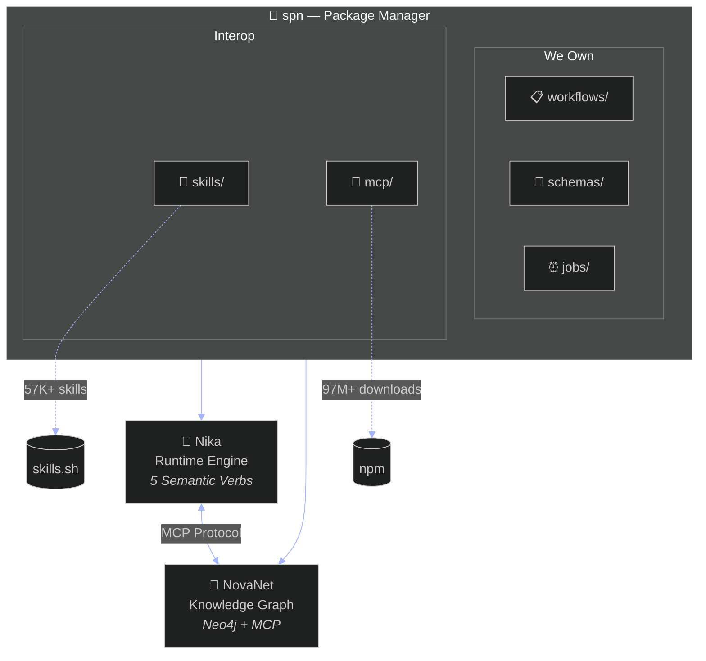
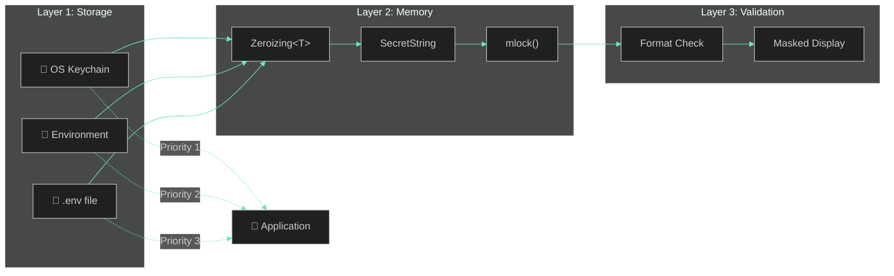

<div align="center">

```
     ✦  ███████╗██████╗ ███╗   ██╗    ██████╗██╗     ██╗  ✦
     ✧  ██╔════╝██╔══██╗████╗  ██║   ██╔════╝██║     ██║  ✧
     ·  ███████╗██████╔╝██╔██╗ ██║   ██║     ██║     ██║  ·
     ·  ╚════██║██╔═══╝ ██║╚██╗██║   ██║     ██║     ██║  ·
     ✧  ███████║██║     ██║ ╚████║   ╚██████╗███████╗██║  ✧
     ✦  ╚══════╝╚═╝     ╚═╝  ╚═══╝    ╚═════╝╚══════╝╚═╝  ✦
```

## 🏴‍☠️ ✨ SUPERNOVAE ✨ 🏴‍☠️

### Package Manager for AI Workflows, Schemas & Agents

[](https://github.com/supernovae-st/supernovae-cli/releases)
[](https://crates.io/crates/spn)
[](LICENSE)
[](https://discord.gg/supernovae)

**The unified CLI for the SuperNovae ecosystem**

[Installation](#-installation) · [Quick Start](#-quick-start) · [Commands](#-commands-reference) · [Ecosystem](#-the-supernovae-ecosystem)

</div>

---

## ✨ Highlights

- 🚀 **Unified CLI** — One tool for [Nika](https://github.com/supernovae-st/nika) (runtime) + [NovaNet](https://github.com/supernovae-st/novanet) (knowledge graph)
- 📦 **Rich Ecosystem** — 48 MCP server aliases, 57K+ skills from [skills.sh](https://skills.sh)
- 🔐 **Secure by Design** — OS Keychain integration with memory protection (v0.6.0)
- ⚡ **Cargo-style Index** — Sparse registry for lightning-fast package resolution

---

## 🚀 Installation

```bash
# Homebrew (recommended)
brew install supernovae-st/tap/spn

# Cargo
cargo install spn

# From source
git clone https://github.com/supernovae-st/supernovae-cli && cd supernovae-cli && cargo install --path .
```

Verify installation:

```bash
spn --version  # spn 0.6.0
spn doctor     # System diagnostic
```

---

## ⚡ Quick Start

```bash
# 1. Initialize a project
spn init

# 2. Add packages
spn add @nika/generate-page      # Workflow
spn skill add brainstorming      # Skill (via skills.sh)
spn mcp add neo4j                # MCP server (via npm)

# 3. Sync to your editor
spn sync --target claude
```

---

## 🌌 The SuperNovae Ecosystem



### Mascots & Roles

| Mascot | Role | Description |
|--------|------|-------------|
| **Nika** 🦋 | Runtime | Orchestrates workflows via 5 semantic verbs: `infer`, `exec`, `fetch`, `invoke`, `agent` |
| **NovaNet** 🧠 | Brain | Knowledge graph for localization, entities, and semantic relationships |
| **spn** 🌟 | Manager | Unified package management across the ecosystem |

> **Note:** Nika is NOT an agent. Nika is the runtime that *orchestrates* agents.

---

## 📦 Package Types

| Type | Scope | Description | Example |
|:-----|:------|:------------|:--------|
| **workflow** | `@nika/`, `@workflows/` | YAML DAG definitions | `@nika/generate-page` |
| **schema** | `@novanet/`, `@schemas/` | Graph node/arc classes | `@novanet/core-schema` |
| **job** | `@jobs/` | Cron/webhook triggers | `@jobs/daily-report` |
| **skill** | `@skills/` | Reusable prompts | `brainstorming` |
| **agent** | `@agents/` | Agent configurations | `@agents/code-reviewer` |
| **prompt** | `@prompts/` | Prompt templates | `@prompts/seo-meta` |

---

## 📖 Commands Reference

<details open>
<summary><strong>📦 Package Management</strong></summary>

| Command | Description |
|:--------|:------------|
| `spn add <package>` | Add package to manifest and install |
| `spn remove <package>` | Remove a package |
| `spn install` | Install all packages from `spn.yaml` |
| `spn install --frozen` | Install exact versions from lockfile |
| `spn update [package]` | Update to latest compatible versions |
| `spn search <query>` | Search the registry |
| `spn info <package>` | Show package details |
| `spn list` | List installed packages |
| `spn outdated` | Show available updates |
| `spn publish` | Publish to registry |

</details>

<details>
<summary><strong>🔐 Security</strong> <code>v0.6.0</code></summary>

| Command | Description |
|:--------|:------------|
| `spn provider list` | List all API keys and sources |
| `spn provider set <name>` | Store key in OS Keychain |
| `spn provider get <name>` | Get masked key |
| `spn provider get <name> --unmask` | Get full key (for scripts) |
| `spn provider delete <name>` | Remove from keychain |
| `spn provider migrate` | Migrate env vars to keychain |
| `spn provider test <name\|all>` | Validate key format |

**Supported Providers:**

| Type | Providers |
|:-----|:----------|
| LLM | `anthropic`, `openai`, `mistral`, `groq`, `deepseek`, `gemini`, `ollama` |
| MCP | `neo4j`, `github`, `slack`, `perplexity`, `firecrawl`, `supadata` |

</details>

<details>
<summary><strong>🎯 Skills</strong> <em>(via skills.sh)</em></summary>

| Command | Description |
|:--------|:------------|
| `spn skill add <name>` | Add a skill |
| `spn skill remove <name>` | Remove a skill |
| `spn skill list` | List installed skills |
| `spn skill search <query>` | Search skills.sh |

</details>

<details>
<summary><strong>🔌 MCP Servers</strong> <em>(via npm)</em></summary>

| Command | Description |
|:--------|:------------|
| `spn mcp add <name>` | Add an MCP server |
| `spn mcp remove <name>` | Remove a server |
| `spn mcp list` | List installed servers |
| `spn mcp test <name>` | Test server connection |

</details>

<details>
<summary><strong>🦋 Nika Integration</strong></summary>

| Command | Description |
|:--------|:------------|
| `spn nk run <file>` | Run a workflow |
| `spn nk check <file>` | Validate workflow syntax |
| `spn nk studio` | Open Nika Studio TUI |
| `spn nk jobs start` | Start jobs daemon |
| `spn nk jobs status` | Check daemon status |
| `spn nk jobs stop` | Stop daemon |

</details>

<details>
<summary><strong>🧠 NovaNet Integration</strong></summary>

| Command | Description |
|:--------|:------------|
| `spn nv tui` | Open NovaNet TUI |
| `spn nv query <query>` | Query knowledge graph |
| `spn nv mcp start` | Start MCP server |
| `spn nv add-node <name>` | Add a node type |
| `spn nv add-arc <name>` | Add an arc type |
| `spn nv db start` | Start Neo4j |
| `spn nv db seed` | Seed database |
| `spn nv db reset` | Reset database |

</details>

<details>
<summary><strong>🔄 Sync & Configuration</strong></summary>

| Command | Description |
|:--------|:------------|
| `spn sync` | Sync to all enabled editors |
| `spn sync --target <editor>` | Sync to specific editor |
| `spn sync --dry-run` | Preview changes |
| `spn config show` | Show merged configuration |
| `spn config edit` | Edit project config |
| `spn schema status` | Show schema state |
| `spn schema validate` | Validate coherence |
| `spn doctor` | Run system diagnostic |
| `spn init` | Initialize project |

</details>

---

## 🔐 Security Architecture



**Defense-in-depth protection:**

| Layer | Protection | Technology |
|:------|:-----------|:-----------|
| Storage | Encrypted at rest | macOS Keychain, Windows Credential, Linux Secret Service |
| Memory | Auto-clear on drop | `zeroize`, `secrecy` crates |
| Memory | Prevent swap | `mlock()` via `libc` |
| Memory | Exclude from dumps | `MADV_DONTDUMP` (Linux) |
| Validation | Format verification | Provider-specific patterns |
| Display | Masked output | `sk-ant...X` format |

---

## ⚙️ Configuration

### Project Manifest (`spn.yaml`)

```yaml
name: my-project
version: 0.1.0

# Packages we own
workflows:
  - "@nika/generate-page@^1.0.0"
  - "@nika/seo-audit@^2.0.0"

schemas:
  - "@novanet/core-schema@^0.14.0"

# Interop packages
skills:
  - "brainstorming"
  - "superpowers/tdd"

mcp:
  - "neo4j"
  - "perplexity"

# Editor sync
sync:
  claude: true
  cursor: false
  nika: true
```

### MCP Servers (`.mcp.yaml`)

```yaml
servers:
  neo4j:
    package: "@neo4j/mcp-server-neo4j"
    env:
      NEO4J_URI: "bolt://localhost:7687"

  github:
    package: "@modelcontextprotocol/server-github"
```

### Local Secrets (`.mcp.local.yaml`) — *gitignored*

```yaml
servers:
  neo4j:
    env:
      NEO4J_PASSWORD: "your-password"
```

---

## 🔌 MCP Server Aliases

`spn` provides **48 short aliases** for popular MCP servers:

| Alias | Package |
|:------|:--------|
| `neo4j` | `@neo4j/mcp-server-neo4j` |
| `github` | `@modelcontextprotocol/server-github` |
| `filesystem` | `@modelcontextprotocol/server-filesystem` |
| `perplexity` | `perplexity-mcp` |
| `firecrawl` | `firecrawl-mcp` |
| `supabase` | `@supabase/mcp-server-supabase` |
| `postgres` | `@modelcontextprotocol/server-postgres` |
| `sqlite` | `@modelcontextprotocol/server-sqlite` |
| `slack` | `@modelcontextprotocol/server-slack` |
| `puppeteer` | `@anthropic/mcp-puppeteer` |

<details>
<summary>See all 48 aliases</summary>

Run `spn mcp list --all` to see the complete list.

</details>

---

## 🗂️ Directory Structure

```
~/.spn/                          # Global spn directory
├── cache/                       # Downloaded packages
│   ├── workflows/
│   ├── schemas/
│   ├── skills/
│   └── ...
├── config.yaml                  # User configuration
└── bin/                         # Binary stubs

./                               # Project directory
├── spn.yaml                     # Package manifest (committed)
├── spn.lock                     # Resolved versions (committed)
├── spn.local.yaml               # Local overrides (gitignored)
├── .mcp.yaml                    # Team MCP servers (committed)
└── .mcp.local.yaml              # Personal API keys (gitignored)
```

---

## 🔗 Related Projects

| Repository | Description |
|:-----------|:------------|
| [nika](https://github.com/supernovae-st/nika) | 🦋 Semantic YAML workflow engine |
| [novanet](https://github.com/supernovae-st/novanet) | 🧠 Knowledge graph for localization |
| [supernovae-registry](https://github.com/supernovae-st/supernovae-registry) | 📦 Public package registry |
| [supernovae-index](https://github.com/supernovae-st/supernovae-index) | 📇 Sparse package index |
| [homebrew-tap](https://github.com/supernovae-st/homebrew-tap) | 🍺 Homebrew formulas |

---

## 🤝 Contributing

```bash
# Clone
git clone https://github.com/supernovae-st/supernovae-cli
cd supernovae-cli

# Build & Test
cargo build
cargo test            # 158 tests
cargo clippy          # Lint

# Install locally
cargo install --path .
```

**Conventions:**
- Commits: `type(scope): description`
- Code style: `cargo fmt` + `cargo clippy`
- Testing: TDD preferred

---

## 📄 License

MIT © [SuperNovae Studio](https://supernovae.studio)

---

<div align="center">

**[Documentation](https://docs.supernovae.studio)** · **[Registry](https://registry.supernovae.studio)** · **[Discord](https://discord.gg/supernovae)**

*Built with 🦀 Rust and ✨ cosmic energy*

</div>
