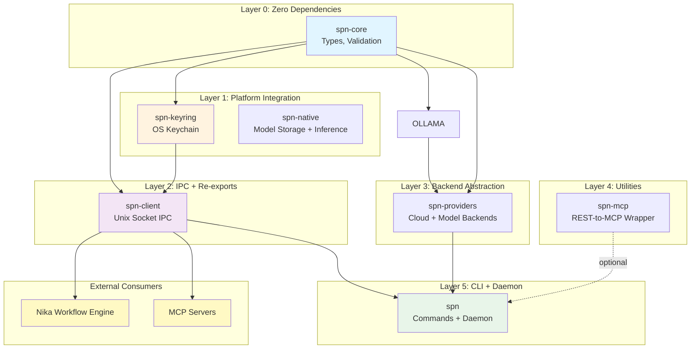
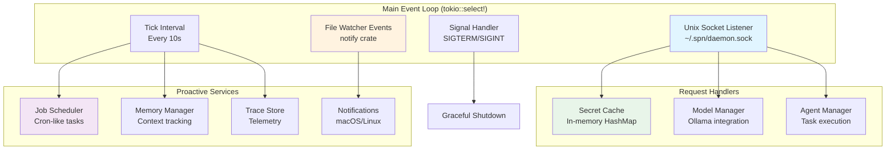
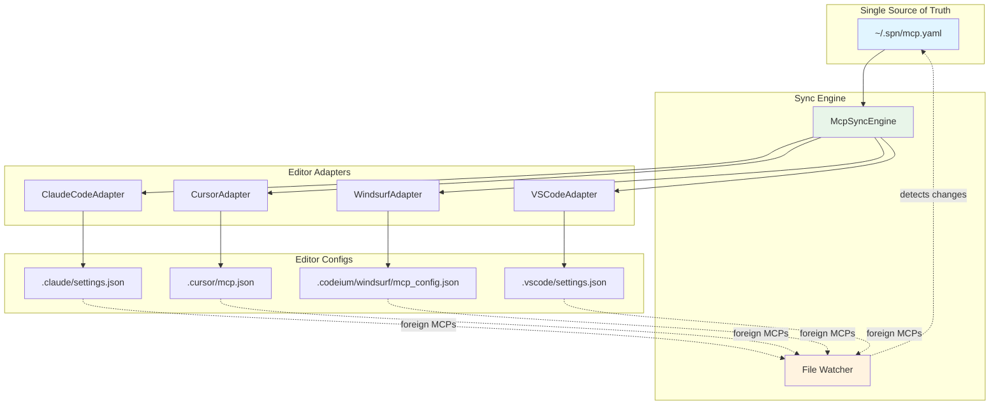
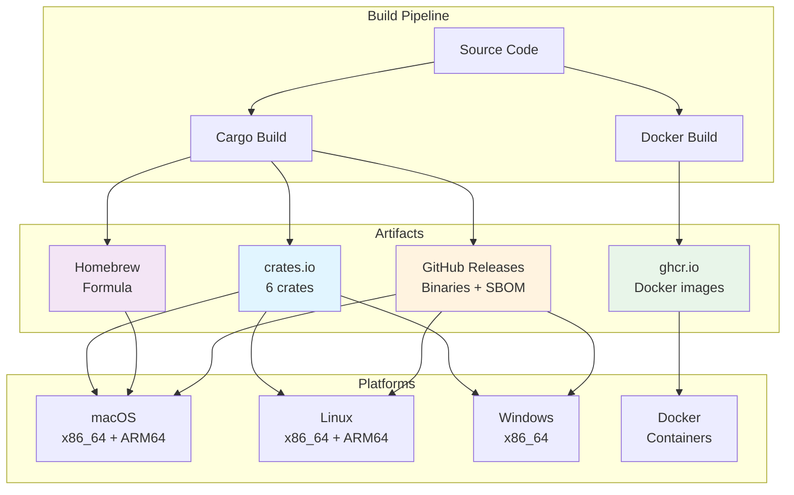

# spn-cli Architecture Documentation

**Version:** v0.15.0
**Last Updated:** 2026-03-10
**Status:** Production

---

## Table of Contents

1. [Executive Summary](#executive-summary)
2. [Workspace Architecture](#workspace-architecture)
3. [Daemon Architecture](#daemon-architecture)
4. [Provider System](#provider-system)
5. [MCP Integration](#mcp-integration)
6. [Security Model](#security-model)
7. [Configuration System](#configuration-system)
8. [Sync System](#sync-system)
9. [Extension Points](#extension-points)
10. [Performance Characteristics](#performance-characteristics)
11. [Deployment Architecture](#deployment-architecture)

---

## Executive Summary

`spn-cli` (SuperNovae CLI) is a unified toolkit for managing AI workflows, LLM providers, and MCP servers. It solves the fundamental problem of **macOS Keychain popup fatigue** through a daemon architecture, while providing a comprehensive package management system for AI tooling.

### Core Innovation

```
❌ WITHOUT spn daemon:          ✅ WITH spn daemon:
Nika    → Keychain (popup)     Nika    → spn-client → daemon.sock
MCP #1  → Keychain (popup)     MCP #1  →              ↓
MCP #2  → Keychain (popup)     MCP #2  →          Keychain
MCP #3  → Keychain (popup)     MCP #3  →      (ONE accessor)
```

**Result:** One authorization at daemon start, then zero popups for all consumers.

### Key Characteristics

| Aspect | Value |
|--------|-------|
| **Language** | Rust 2021 (MSRV 1.85) |
| **Test Coverage** | 1,288+ tests across workspace |
| **Crates** | 7 crates (layered architecture) |
| **Providers** | 7 LLM + 6 MCP secrets |
| **Security** | OS keychain + mlock + zeroizing |
| **Distribution** | Cargo, Homebrew, Docker, GitHub Releases |

---

## Workspace Architecture

### 7-Crate Layered Design



### Crate Responsibilities

#### spn-core (v0.1.1)

**Purpose:** Single source of truth for types and validation.

**Design Principles:**
- Zero dependencies (fast compilation, WASM-compatible)
- Pure Rust, no unsafe code
- Shared by all other crates

**Exports:**
```rust
// Provider registry
pub const KNOWN_PROVIDERS: &[Provider] = &[
    Provider {
        id: "anthropic",
        name: "Anthropic",
        env_var: "ANTHROPIC_API_KEY",
        category: ProviderCategory::LLM,
        key_prefix: "sk-ant-",
    },
    // ... 12 more providers
];

// Validation
pub fn validate_key_format(provider: &str, key: &str) -> ValidationResult;
pub fn mask_key(key: &str) -> String;

// MCP types
pub struct McpServer {
    pub command: String,
    pub args: Vec<String>,
    pub env: HashMap<String, String>,
}

// Model backend types
pub struct ModelInfo { /* ... */ }
pub enum BackendError { /* ... */ }
```

**Why Zero Dependencies?**
- Fast compilation (no transitive deps)
- WASM-compatible (future browser tools)
- Safe for circular dependency chains

---

#### spn-keyring (v0.1.3)

**Purpose:** OS keychain abstraction with memory protection.

**Platform Support:**
| Platform | Backend | Status |
|----------|---------|--------|
| macOS | Keychain Access | ✅ Production |
| Linux | Secret Service (GNOME/KWallet) | ✅ Production |
| Windows | Credential Manager | ✅ Production |
| Docker | Feature-gated (disabled) | ✅ Fallback |

**Security Guarantees:**
```rust
// All returned keys use Zeroizing<String>
impl SpnKeyring {
    pub fn get(provider: &str) -> Result<Zeroizing<String>>;
    pub fn get_secret(provider: &str) -> Result<SecretString>;
    pub fn set(provider: &str, key: &str) -> Result<()>;
    pub fn delete(provider: &str) -> Result<()>;

    // macOS-only: Pre-authorize app to prevent popups
    #[cfg(target_os = "macos")]
    pub fn set_with_acl(
        provider: &str,
        key: &str,
        authorized_app: &Path
    ) -> Result<()>;
}
```

**Memory Protection:**
1. **Zeroizing<T>** - Auto-clear on drop (zeroize crate)
2. **SecretString** - Prevents Debug/Display exposure (secrecy crate)
3. **mlock()** - Prevents swap to disk (Unix libc)
4. **MADV_DONTDUMP** - Excludes from core dumps (Linux)

**Feature Flags:**
```toml
[features]
default = ["os-keychain"]
os-keychain = ["keyring"]  # Enable OS integration
```

When `os-keychain` is disabled (Docker builds), all operations return `KeyringError::Locked`, triggering automatic fallback to environment variables.

---

#### spn-client (v0.3.1)

**Purpose:** SDK for external tools to communicate with the daemon.

**IPC Protocol:**
- Unix socket: `~/.spn/daemon.sock`
- Permissions: `0600` (owner-only)
- Protocol: Length-prefixed JSON messages
- Timeout: 30 seconds (configurable)

**Client API:**
```rust
#[derive(Debug)]
pub struct SpnClient {
    stream: Option<UnixStream>,
    fallback_mode: bool,
    timeout: Duration,
}

impl SpnClient {
    // Connect to daemon
    pub async fn connect() -> Result<Self>;

    // Connect with env var fallback
    pub async fn connect_with_fallback() -> Result<Self>;

    // Protocol operations
    pub async fn ping(&mut self) -> Result<String>;
    pub async fn get_secret(&mut self, provider: &str) -> Result<SecretString>;
    pub async fn has_secret(&mut self, provider: &str) -> Result<bool>;
    pub async fn list_providers(&mut self) -> Result<Vec<String>>;
    pub async fn refresh_secret(&mut self, provider: &str) -> Result<bool>;
    pub async fn watcher_status(&mut self) -> Result<WatcherStatusInfo>;

    // Low-level request/response
    pub async fn send_request(&mut self, req: Request) -> Result<Response>;
}
```

**Protocol Messages:**
```rust
#[derive(Serialize, Deserialize)]
pub enum Request {
    Ping,
    GetSecret { provider: String },
    HasSecret { provider: String },
    ListProviders,
    RefreshSecret { provider: String },
    WatcherStatus,
}

#[derive(Serialize, Deserialize)]
pub enum Response {
    Pong { protocol_version: u8, version: String },
    Secret { value: String },
    Exists { exists: bool },
    Providers { providers: Vec<String> },
    Refreshed { refreshed: bool },
    WatcherStatusResult { status: WatcherStatusInfo },
    Error { message: String },
}
```

**Versioning:**
```rust
pub const PROTOCOL_VERSION: u8 = 1;
```

When protocol versions mismatch, the client warns but allows connection. This enables rolling upgrades without breaking existing consumers.

**Re-exports:**
```rust
// Re-export all spn-core types for convenience
pub use spn_core::{
    Provider, ProviderCategory, KNOWN_PROVIDERS,
    validate_key_format, mask_key,
    McpServer, McpConfig,
    ModelInfo, BackendError,
    // ... all core types
};
```

This makes `spn-client` a **batteries-included SDK** for external tools.

---

#### spn-native (v0.1.0)

**Purpose:** Native model storage and inference via HuggingFace + mistral.rs.

**Features:**
- HuggingFace model downloads with progress tracking
- Local model storage in `~/.spn/models/`
- Native inference via mistral.rs (optional feature)
- GGUF model support

**Model Storage:**
```rust
pub struct ModelStore {
    root: PathBuf,  // ~/.spn/models/
}

impl ModelStore {
    pub async fn download(&self, model_id: &str, progress: ProgressCallback) -> Result<PathBuf>;
    pub async fn list(&self) -> Result<Vec<LocalModel>>;
    pub async fn delete(&self, model_id: &str) -> Result<()>;
}
```

**Progress Callbacks:**
```rust
pub type ProgressCallback = Box<dyn Fn(PullProgress) + Send + Sync>;

pub enum PullProgress {
    Downloading { percent: f64, total: u64, current: u64 },
    Extracting { layer: String },
    Complete,
    Error(String),
}
```

**Why Separate Crate?**
- **Optional inference:** Download-only or full inference via features
- **HuggingFace integration:** Direct model downloads from HF Hub
- **Clean boundary:** Storage separate from inference

---

#### spn-providers (v0.1.0)

**Purpose:** Backend abstraction layer for cloud providers and model management.

**Architecture:**
```
┌─────────────────────────────────────────────────────────────┐
│  spn-providers                                              │
├─────────────────────────────────────────────────────────────┤
│                                                             │
│  ┌────────────────────────────────────────────────────┐    │
│  │ CloudBackend Trait (cloud LLM providers)           │    │
│  │ ├── AnthropicBackend  (feature: "anthropic")       │    │
│  │ ├── OpenAIBackend     (feature: "openai")          │    │
│  │ ├── MistralBackend    (feature: "mistral")         │    │
│  │ ├── GroqBackend       (feature: "groq")            │    │
│  │ ├── DeepSeekBackend   (feature: "deepseek")        │    │
│  │ └── GeminiBackend     (feature: "gemini")          │    │
│  └────────────────────────────────────────────────────┘    │
│                                                             │
│  ┌────────────────────────────────────────────────────┐    │
│  │ BackendRegistry                                    │    │
│  │ ├── register<B: CloudBackend>()                    │    │
│  │ ├── get(kind: BackendKind) -> Option<Backend>      │    │
│  │ └── list_available() -> Vec<BackendKind>           │    │
│  └────────────────────────────────────────────────────┘    │
│                                                             │
│  ┌────────────────────────────────────────────────────┐    │
│  │ ModelOrchestrator                                  │    │
│  │ ├── resolve("@models/claude-sonnet")               │    │
│  │ ├── resolve("@models/llama3.2:8b")                 │    │
│  │ └── chat(alias, messages) -> routes to backend     │    │
│  └────────────────────────────────────────────────────┘    │
│                                                             │
└─────────────────────────────────────────────────────────────┘
```

**CloudBackend Trait:**
```rust
#[async_trait]
pub trait CloudBackend: Send + Sync {
    fn backend_kind(&self) -> BackendKind;

    async fn chat(
        &self,
        messages: &[ChatMessage],
        options: Option<ChatOptions>,
    ) -> Result<ChatResponse>;

    async fn embed(&self, texts: &[String]) -> Result<EmbeddingResponse>;
}
```

**BackendKind:**
```rust
#[derive(Debug, Clone, Copy, PartialEq, Eq, Hash)]
pub enum BackendKind {
    Anthropic,
    OpenAI,
    Mistral,
    Groq,
    DeepSeek,
    Gemini,
    Ollama,
}
```

**ModelOrchestrator:**
```rust
pub struct ModelOrchestrator {
    registry: BackendRegistry,
    aliases: HashMap<String, ModelRef>,
}

impl ModelOrchestrator {
    pub fn new(registry: BackendRegistry) -> Self;

    pub fn resolve(&self, alias: &str) -> Result<ModelRef>;

    pub async fn chat(
        &self,
        alias: &str,
        messages: &[ChatMessage],
        options: Option<ChatOptions>,
    ) -> Result<ChatResponse>;
}
```

**@models/ Alias System:**
```yaml
# User-defined aliases
@models/claude-sonnet: anthropic/claude-sonnet-4-5
@models/fast: groq/llama3.2:8b
@models/local: ollama/llama3.2:8b
```

---

#### spn-mcp (v0.1.2)

**Purpose:** Dynamic REST-to-MCP wrapper for non-MCP APIs.

**Use Case:** Wrap arbitrary REST APIs as MCP servers.

**Configuration:**
```yaml
# spn-mcp.yaml
server_name: "my-api"
base_url: "https://api.example.com"
auth:
  type: bearer
  token: "${MY_API_KEY}"

endpoints:
  - path: "/users"
    method: GET
    tool_name: "list_users"
    description: "List all users"

  - path: "/users"
    method: POST
    tool_name: "create_user"
    parameters:
      - name: username
        type: string
        required: true
```

**Generated MCP Tools:**
```json
{
  "tools": [
    {
      "name": "list_users",
      "description": "List all users",
      "inputSchema": {
        "type": "object",
        "properties": {}
      }
    },
    {
      "name": "create_user",
      "description": "Create a new user",
      "inputSchema": {
        "type": "object",
        "properties": {
          "username": { "type": "string" }
        },
        "required": ["username"]
      }
    }
  ]
}
```

**Runtime:**
```rust
pub struct McpServer {
    config: McpConfig,
    client: reqwest::Client,
    rate_limiter: RateLimiter,
}

impl McpServer {
    pub async fn handle_tool_call(&self, name: &str, args: Value) -> Result<Value>;
}
```

**Rate Limiting:**
```rust
pub struct RateLimiter {
    requests_per_minute: u32,
    window: Duration,
    requests: VecDeque<Instant>,
}
```

---

#### spn (v0.15.0)

**Purpose:** Main CLI and daemon process.

**Structure:**
```
crates/spn/src/
├── main.rs              # CLI entry point
├── commands/            # CLI subcommands
│   ├── doctor.rs
│   ├── install.rs
│   ├── model/
│   ├── skill.rs
│   └── status.rs
├── daemon/              # Background daemon
│   ├── service.rs       # Daemon event loop
│   ├── watcher.rs       # File system watcher
│   ├── model_manager.rs
│   ├── agents/
│   ├── jobs/
│   ├── memory/
│   └── traces/
├── config/              # Configuration management
│   ├── global.rs        # ~/.spn/config.toml
│   ├── team.rs          # ./mcp.yaml
│   ├── local.rs         # ./.spn/local.yaml
│   └── resolver.rs      # 3-level scope
├── mcp/                 # MCP server management
│   ├── config.rs
│   └── types.rs
├── sync/                # Editor synchronization
│   ├── adapters.rs      # IDE-specific adapters
│   └── mcp_sync.rs      # MCP config sync
├── secrets/             # Secret management
│   ├── storage.rs
│   └── wizard.rs
└── ux/                  # Terminal UI
    ├── design_system.rs
    ├── themes.rs
    └── progress.rs
```

---

## Daemon Architecture

### Event Loop Design



### Daemon Lifecycle

```rust
pub struct DaemonService {
    // IPC
    socket_path: PathBuf,
    listener: UnixListener,

    // State
    secrets: Arc<RwLock<HashMap<String, SecretString>>>,
    model_manager: ModelManager,
    agent_manager: AgentManager,

    // Proactive
    job_scheduler: JobScheduler,
    memory_manager: MemoryManager,
    trace_store: TraceStore,

    // Watcher
    watcher: WatcherService,
    event_rx: broadcast::Receiver<WatchEvent>,

    // Lifecycle
    shutdown_tx: broadcast::Sender<()>,
    tasks: JoinSet<Result<()>>,
}

impl DaemonService {
    pub async fn start() -> Result<()> {
        // 1. Lock PID file (single-instance guarantee)
        let pid_file = Self::acquire_pid_lock()?;

        // 2. Create Unix socket
        let listener = Self::create_socket().await?;

        // 3. Initialize services
        let (watcher, event_rx) = WatcherService::new()?;
        watcher.start()?;

        let service = Self {
            listener,
            watcher,
            event_rx,
            // ... initialize all services
        };

        // 4. Run event loop
        service.run().await?;

        // 5. Cleanup
        service.shutdown().await?;
        drop(pid_file); // Release lock

        Ok(())
    }

    async fn run(&mut self) -> Result<()> {
        let mut ticker = tokio::time::interval(Duration::from_secs(10));

        loop {
            tokio::select! {
                // Handle IPC requests
                Ok((stream, _)) = self.listener.accept() => {
                    let handler = self.clone_handler();
                    self.tasks.spawn(async move {
                        handler.handle_connection(stream).await
                    });
                }

                // Handle file watcher events
                Ok(event) = self.event_rx.recv() => {
                    self.handle_watch_event(event).await?;
                }

                // Handle signals
                _ = tokio::signal::ctrl_c() => {
                    info!("Received SIGINT, shutting down");
                    break;
                }

                // Periodic tasks
                _ = ticker.tick() => {
                    self.run_periodic_tasks().await?;
                }
            }
        }

        Ok(())
    }
}
```

### Single-Instance Guarantee

```rust
use std::fs::File;
use std::os::unix::io::AsRawFd;

impl DaemonService {
    fn acquire_pid_lock() -> Result<File> {
        let path = SpnPaths::new()?.pid_file();
        let file = File::create(&path)?;

        // Exclusive lock (flock)
        unsafe {
            let fd = file.as_raw_fd();
            if libc::flock(fd, libc::LOCK_EX | libc::LOCK_NB) != 0 {
                return Err(SpnError::DaemonAlreadyRunning);
            }
        }

        // Write PID
        std::io::Write::write_all(
            &mut &file,
            std::process::id().to_string().as_bytes(),
        )?;

        Ok(file) // Holds lock until dropped
    }
}
```

### Secret Cache

```rust
pub struct SecretCache {
    cache: Arc<RwLock<HashMap<String, CachedSecret>>>,
}

struct CachedSecret {
    value: SecretString,
    loaded_at: Instant,
    ttl: Duration, // Default: 1 hour
}

impl SecretCache {
    pub async fn get(&self, provider: &str) -> Result<SecretString> {
        // Check cache
        {
            let cache = self.cache.read().await;
            if let Some(cached) = cache.get(provider) {
                if cached.loaded_at.elapsed() < cached.ttl {
                    return Ok(cached.value.clone());
                }
            }
        }

        // Load from keychain
        let value = SpnKeyring::get_secret(provider)?;

        // Update cache
        {
            let mut cache = self.cache.write().await;
            cache.insert(provider.to_string(), CachedSecret {
                value: value.clone(),
                loaded_at: Instant::now(),
                ttl: Duration::from_secs(3600),
            });
        }

        Ok(value)
    }

    pub async fn refresh(&self, provider: &str) -> Result<bool> {
        // Invalidate cache entry
        {
            let mut cache = self.cache.write().await;
            cache.remove(provider);
        }

        // Reload
        self.get(provider).await.map(|_| true)
    }
}
```

### File Watcher (MCP Auto-Sync)

**Watch Strategy:** A + Lite C (Always global + 5 recent projects)

```rust
pub struct WatcherService {
    watcher: RecommendedWatcher,
    rx: mpsc::UnboundedReceiver<notify::Result<Event>>,
    watched_paths: FxHashSet<PathBuf>,
    recent: RecentProjects,
    foreign: ForeignTracker,
    notifier: NotificationService,
    last_event: FxHashMap<PathBuf, Instant>,
    our_writes: FxHashMap<PathBuf, u64>, // Checksum tracking
    event_tx: broadcast::Sender<WatchEvent>,
}

impl WatcherService {
    pub fn start(&mut self) -> Result<()> {
        // Watch global configs
        self.watch_path(&home.join(".spn/mcp.yaml"))?;
        self.watch_path(&home.join(".cursor/mcp.json"))?;
        self.watch_path(&home.join(".claude.json"))?;

        // Watch recent project configs (top 5)
        for project in self.recent.watch_paths() {
            self.watch_path(&project.join(".cursor/mcp.json"))?;
            self.watch_path(&project.join(".mcp.json"))?;
            self.watch_path(&project.join(".claude/settings.json"))?;
        }

        Ok(())
    }

    pub async fn handle_event(&mut self, event: Event) -> Result<()> {
        match event.kind {
            EventKind::Modify(_) | EventKind::Create(_) => {
                for path in event.paths {
                    // Debounce
                    if !self.should_process(&path) {
                        continue;
                    }

                    // Load content
                    let content = fs::read(&path)?;

                    // Check if we wrote this (origin tracking)
                    if self.is_our_write(&path, &content) {
                        debug!("Ignoring our own write to {}", path.display());
                        continue;
                    }

                    // Detect changes
                    if self.is_spn_config(&path) {
                        // Our config changed → sync to clients
                        self.event_tx.send(WatchEvent::SyncNeeded)?;
                    } else if self.is_client_config(&path) {
                        // Client config changed → detect foreign MCPs
                        self.detect_foreign_mcps(&path, &content).await?;
                    }
                }
            }
            _ => {}
        }

        Ok(())
    }

    async fn detect_foreign_mcps(&mut self, path: &Path, content: &[u8]) -> Result<()> {
        let client_config = parse_client_config(path, content)?;
        let spn_config = McpConfigManager::new().load_resolved()?;

        let diff = diff_mcp_configs(&spn_config, &client_config);

        for foreign in diff.foreign_servers {
            // Track new foreign MCP
            self.foreign.add(ForeignMcp {
                name: foreign.name.clone(),
                server: foreign.server,
                source: ForeignSource::from_path(path),
                scope: ForeignScope::from_path(path),
                detected_at: SystemTime::now(),
            });

            // Notify user
            self.notifier.notify_foreign_mcp(&foreign)?;

            // Emit event
            self.event_tx.send(WatchEvent::ForeignMcpDetected(foreign))?;
        }

        Ok(())
    }

    // Origin tracking to prevent infinite loops
    pub fn mark_our_write(&mut self, path: &Path, content: &[u8]) {
        let checksum = Self::compute_checksum(content);
        self.our_writes.insert(path.to_path_buf(), checksum);
    }

    fn is_our_write(&mut self, path: &Path, content: &[u8]) -> bool {
        if let Some(expected) = self.our_writes.remove(path) {
            let current = Self::compute_checksum(content);
            expected == current
        } else {
            false
        }
    }
}
```

**Foreign MCP Detection:**
```rust
pub struct ForeignMcp {
    pub name: String,
    pub server: McpServer,
    pub source: ForeignSource,  // Cursor, Claude Code, etc.
    pub scope: ForeignScope,    // Global, Project
    pub detected_at: SystemTime,
}

#[derive(Debug, Clone)]
pub enum ForeignSource {
    Cursor,
    ClaudeCode,
    Windsurf,
    Unknown(String),
}

#[derive(Debug, Clone)]
pub enum ForeignScope {
    Global,     // ~/.cursor/mcp.json
    Project,    // ./.cursor/mcp.json
}
```

---

## Provider System

### Provider Registry

**Single Source of Truth:**
```rust
// In spn-core/src/providers.rs
pub const KNOWN_PROVIDERS: &[Provider] = &[
    // LLM Providers
    Provider {
        id: "anthropic",
        name: "Anthropic",
        env_var: "ANTHROPIC_API_KEY",
        category: ProviderCategory::LLM,
        key_prefix: "sk-ant-",
    },
    Provider {
        id: "openai",
        name: "OpenAI",
        env_var: "OPENAI_API_KEY",
        category: ProviderCategory::LLM,
        key_prefix: "sk-",
    },
    Provider {
        id: "mistral",
        name: "Mistral AI",
        env_var: "MISTRAL_API_KEY",
        category: ProviderCategory::LLM,
        key_prefix: "",
    },
    Provider {
        id: "groq",
        name: "Groq",
        env_var: "GROQ_API_KEY",
        category: ProviderCategory::LLM,
        key_prefix: "gsk_",
    },
    Provider {
        id: "deepseek",
        name: "DeepSeek",
        env_var: "DEEPSEEK_API_KEY",
        category: ProviderCategory::LLM,
        key_prefix: "sk-",
    },
    Provider {
        id: "gemini",
        name: "Google Gemini",
        env_var: "GEMINI_API_KEY",
        category: ProviderCategory::LLM,
        key_prefix: "",
    },
    Provider {
        id: "ollama",
        name: "Ollama",
        env_var: "OLLAMA_HOST",
        category: ProviderCategory::LLM,
        key_prefix: "",
    },

    // MCP Secrets
    Provider {
        id: "neo4j",
        name: "Neo4j",
        env_var: "NEO4J_PASSWORD",
        category: ProviderCategory::MCP,
        key_prefix: "",
    },
    Provider {
        id: "github",
        name: "GitHub",
        env_var: "GITHUB_TOKEN",
        category: ProviderCategory::MCP,
        key_prefix: "ghp_",
    },
    Provider {
        id: "slack",
        name: "Slack",
        env_var: "SLACK_BOT_TOKEN",
        category: ProviderCategory::MCP,
        key_prefix: "xoxb-",
    },
    Provider {
        id: "perplexity",
        name: "Perplexity AI",
        env_var: "PERPLEXITY_API_KEY",
        category: ProviderCategory::MCP,
        key_prefix: "pplx-",
    },
    Provider {
        id: "firecrawl",
        name: "Firecrawl",
        env_var: "FIRECRAWL_API_KEY",
        category: ProviderCategory::MCP,
        key_prefix: "fc-",
    },
    Provider {
        id: "supadata",
        name: "Supadata",
        env_var: "SUPADATA_API_KEY",
        category: ProviderCategory::MCP,
        key_prefix: "",
    },
];
```

### Key Validation

```rust
pub enum ValidationResult {
    Valid,
    InvalidPrefix { expected: String, actual: String },
    TooShort { min_length: usize, actual: usize },
    InvalidFormat { reason: String },
}

impl ValidationResult {
    pub fn is_valid(&self) -> bool {
        matches!(self, Self::Valid)
    }
}

pub fn validate_key_format(provider: &str, key: &str) -> ValidationResult {
    let Some(provider) = find_provider(provider) else {
        return ValidationResult::InvalidFormat {
            reason: format!("Unknown provider: {provider}"),
        };
    };

    // Check prefix
    if !provider.key_prefix.is_empty() && !key.starts_with(provider.key_prefix) {
        return ValidationResult::InvalidPrefix {
            expected: provider.key_prefix.to_string(),
            actual: key.chars().take(10).collect(),
        };
    }

    // Check length (provider-specific)
    let min_length = match provider.id {
        "anthropic" => 100,
        "openai" => 40,
        "github" => 40,
        _ => 20,
    };

    if key.len() < min_length {
        return ValidationResult::TooShort {
            min_length,
            actual: key.len(),
        };
    }

    ValidationResult::Valid
}
```

### Key Masking

```rust
pub fn mask_key(key: &str) -> String {
    if key.len() <= 12 {
        return "••••••••".to_string();
    }

    // Show first 8 chars (prefix), mask the rest
    let prefix = &key[..8];
    format!("{prefix}••••••••")
}
```

**Examples:**
- `sk-ant-api03-abc123def456...` → `sk-ant-a••••••••`
- `gsk_abc123...` → `gsk_abc1••••••••`
- `ghp_abc123...` → `ghp_abc1••••••••`

---

## MCP Integration

### MCP Server Management

**Configuration File:**
```yaml
# ~/.spn/mcp.yaml (single source of truth)
servers:
  neo4j:
    command: npx
    args: ["-y", "@neo4j/mcp-neo4j"]
    env:
      NEO4J_URI: bolt://localhost:7687
      NEO4J_USERNAME: neo4j
      NEO4J_PASSWORD: ${spn:neo4j}
    source: global

  github:
    command: npx
    args: ["-y", "@modelcontextprotocol/server-github"]
    env:
      GITHUB_TOKEN: ${spn:github}
    source: global

  custom-api:
    command: spn-mcp
    args: ["--config", "/path/to/custom.yaml"]
    source: project
```

### Secret Interpolation

```rust
pub fn resolve_env_vars(env: &HashMap<String, String>) -> Result<HashMap<String, String>> {
    let mut resolved = HashMap::new();

    for (key, value) in env {
        let resolved_value = if value.starts_with("${spn:") && value.ends_with('}') {
            // Extract provider name
            let provider = &value[6..value.len()-1];

            // Resolve via spn-client
            let mut client = SpnClient::connect_with_fallback().await?;
            let secret = client.get_secret(provider).await?;

            secret.expose_secret().to_string()
        } else if value.starts_with("${") && value.ends_with('}') {
            // Standard env var
            let var_name = &value[2..value.len()-1];
            std::env::var(var_name)?
        } else {
            value.clone()
        };

        resolved.insert(key.clone(), resolved_value);
    }

    Ok(resolved)
}
```

### Editor Sync

**Supported Editors:**
| Editor | Config Path | Format |
|--------|-------------|--------|
| Claude Code | `.claude/settings.json` | JSON (mcpServers) |
| Cursor | `.cursor/mcp.json` | JSON (mcpServers) |
| Windsurf | `.codeium/windsurf/mcp_config.json` | JSON (mcpServers) |
| VS Code | `.vscode/settings.json` | JSON (mcp.servers) |

**Sync Algorithm:**
```rust
pub struct McpSyncEngine {
    manager: McpConfigManager,
    adapters: HashMap<EditorType, Box<dyn EditorAdapter>>,
}

impl McpSyncEngine {
    pub async fn sync_all(&self) -> Result<SyncReport> {
        let mut report = SyncReport::default();

        // Load spn config (source of truth)
        let spn_config = self.manager.load_resolved()?;

        // Sync to each enabled editor
        for (editor, adapter) in &self.adapters {
            if !adapter.is_enabled()? {
                continue;
            }

            match adapter.sync(&spn_config).await {
                Ok(count) => {
                    report.synced.insert(*editor, count);
                }
                Err(e) => {
                    report.errors.insert(*editor, e);
                }
            }
        }

        Ok(report)
    }
}
```

**EditorAdapter Trait:**
```rust
#[async_trait]
pub trait EditorAdapter: Send + Sync {
    fn editor_type(&self) -> EditorType;
    fn is_enabled(&self) -> Result<bool>;

    async fn sync(&self, config: &McpConfig) -> Result<usize>;
    async fn load(&self) -> Result<McpConfig>;
}
```

**Claude Code Adapter:**
```rust
pub struct ClaudeCodeAdapter {
    settings_path: PathBuf,
}

#[async_trait]
impl EditorAdapter for ClaudeCodeAdapter {
    fn editor_type(&self) -> EditorType {
        EditorType::ClaudeCode
    }

    fn is_enabled(&self) -> Result<bool> {
        Ok(self.settings_path.exists())
    }

    async fn sync(&self, config: &McpConfig) -> Result<usize> {
        // Read existing settings
        let mut settings: Value = if self.settings_path.exists() {
            let content = fs::read_to_string(&self.settings_path)?;
            serde_json::from_str(&content)?
        } else {
            json!({})
        };

        // Convert spn config to Claude Code format
        let mut mcp_servers = Map::new();
        for (name, server) in &config.servers {
            mcp_servers.insert(name.clone(), json!({
                "command": server.command,
                "args": server.args,
                "env": server.env,
            }));
        }

        // Update settings
        settings["mcpServers"] = Value::Object(mcp_servers);

        // Write back
        let content = serde_json::to_string_pretty(&settings)?;
        fs::write(&self.settings_path, content)?;

        Ok(config.servers.len())
    }

    async fn load(&self) -> Result<McpConfig> {
        // Parse Claude Code settings.json
        let content = fs::read_to_string(&self.settings_path)?;
        let settings: Value = serde_json::from_str(&content)?;

        let mut config = McpConfig::default();

        if let Some(mcp_servers) = settings.get("mcpServers").and_then(|v| v.as_object()) {
            for (name, server_value) in mcp_servers {
                let server = McpServer {
                    command: server_value["command"].as_str().unwrap_or("").to_string(),
                    args: server_value["args"]
                        .as_array()
                        .map(|arr| arr.iter().filter_map(|v| v.as_str().map(String::from)).collect())
                        .unwrap_or_default(),
                    env: server_value["env"]
                        .as_object()
                        .map(|obj| obj.iter().map(|(k, v)| (k.clone(), v.as_str().unwrap_or("").to_string())).collect())
                        .unwrap_or_default(),
                    source: Some(McpSource::ClaudeCode),
                };

                config.add_server(name.clone(), server);
            }
        }

        Ok(config)
    }
}
```

---

## Security Model

### Layered Security Architecture

```
┌─────────────────────────────────────────────────────────────┐
│  Layer 5: Application Layer                                 │
│  • Input validation                                         │
│  • Command injection prevention                             │
│  • Path traversal checks                                    │
└─────────────────────────────────────────────────────────────┘
                        ↓
┌─────────────────────────────────────────────────────────────┐
│  Layer 4: IPC Security                                      │
│  • Unix socket permissions (0600)                           │
│  • Peer credential verification (SO_PEERCRED)               │
│  • Single-instance guarantee (flock)                        │
└─────────────────────────────────────────────────────────────┘
                        ↓
┌─────────────────────────────────────────────────────────────┐
│  Layer 3: Memory Protection                                 │
│  • mlock() - prevents swap to disk                          │
│  • MADV_DONTDUMP - excludes from core dumps                 │
│  • Zeroizing<T> - auto-clear on drop                        │
│  • SecretString - prevents Debug/Display                    │
└─────────────────────────────────────────────────────────────┘
                        ↓
┌─────────────────────────────────────────────────────────────┐
│  Layer 2: OS Keychain                                       │
│  • Encrypted storage                                        │
│  • System authentication required                           │
│  • Platform-specific backends                               │
└─────────────────────────────────────────────────────────────┘
                        ↓
┌─────────────────────────────────────────────────────────────┐
│  Layer 1: Hardware Security                                 │
│  • Secure Enclave (macOS)                                   │
│  • TPM (Windows/Linux)                                      │
└─────────────────────────────────────────────────────────────┘
```

### Memory Protection

```rust
use libc::{mlock, MADV_DONTDUMP};
use zeroize::Zeroizing;

/// Lock memory to prevent swapping to disk.
pub fn lock_memory(ptr: *const u8, len: usize) -> Result<()> {
    unsafe {
        if mlock(ptr as *const libc::c_void, len) != 0 {
            return Err(SpnError::MemoryLockFailed);
        }
    }
    Ok(())
}

/// Mark memory as non-dumpable (Linux).
#[cfg(target_os = "linux")]
pub fn mark_no_dump(ptr: *const u8, len: usize) -> Result<()> {
    unsafe {
        if libc::madvise(ptr as *mut libc::c_void, len, MADV_DONTDUMP) != 0 {
            return Err(SpnError::MadviseFailed);
        }
    }
    Ok(())
}

/// Secure string that auto-zeros on drop.
pub struct SecureString {
    inner: Zeroizing<String>,
}

impl SecureString {
    pub fn new(s: String) -> Self {
        let inner = Zeroizing::new(s);

        // Lock memory (best effort)
        let ptr = inner.as_ptr();
        let len = inner.len();
        let _ = lock_memory(ptr, len);

        #[cfg(target_os = "linux")]
        let _ = mark_no_dump(ptr, len);

        Self { inner }
    }

    pub fn expose(&self) -> &str {
        &self.inner
    }
}

impl Drop for SecureString {
    fn drop(&mut self) {
        // Zeroizing handles the actual zeroing
        // We just ensure memory is unlocked
        unsafe {
            let ptr = self.inner.as_ptr();
            let len = self.inner.len();
            libc::munlock(ptr as *const libc::c_void, len);
        }
    }
}
```

### Peer Credential Verification

```rust
use std::os::unix::net::UnixStream;

#[cfg(target_os = "linux")]
pub fn verify_peer_credentials(stream: &UnixStream) -> Result<()> {
    use std::os::unix::io::AsRawFd;

    let fd = stream.as_raw_fd();
    let mut ucred: libc::ucred = unsafe { std::mem::zeroed() };
    let mut len = std::mem::size_of::<libc::ucred>() as libc::socklen_t;

    unsafe {
        if libc::getsockopt(
            fd,
            libc::SOL_SOCKET,
            libc::SO_PEERCRED,
            &mut ucred as *mut _ as *mut libc::c_void,
            &mut len,
        ) != 0 {
            return Err(SpnError::PeerVerificationFailed);
        }
    }

    // Verify UID matches current process
    if ucred.uid != unsafe { libc::getuid() } {
        return Err(SpnError::UnauthorizedAccess);
    }

    Ok(())
}

#[cfg(target_os = "macos")]
pub fn verify_peer_credentials(stream: &UnixStream) -> Result<()> {
    use std::os::unix::io::AsRawFd;

    let fd = stream.as_raw_fd();
    let mut uid: libc::uid_t = 0;
    let mut gid: libc::gid_t = 0;

    unsafe {
        if libc::getpeereid(fd, &mut uid, &mut gid) != 0 {
            return Err(SpnError::PeerVerificationFailed);
        }
    }

    // Verify UID matches current process
    if uid != unsafe { libc::getuid() } {
        return Err(SpnError::UnauthorizedAccess);
    }

    Ok(())
}
```

### macOS Keychain ACL

**Problem:** macOS shows "allow access?" popup for every keychain access.

**Solution:** Pre-authorize the daemon binary.

```rust
#[cfg(target_os = "macos")]
pub fn set_with_acl(provider: &str, key: &str, authorized_app: &Path) -> Result<()> {
    // 1. Validate inputs
    validate_key_format(provider, key)?;
    validate_app_path(authorized_app)?;

    // 2. Delete existing entry (security command doesn't update ACL)
    let _ = Self::delete(provider);

    // 3. Get login keychain path
    let home = std::env::var("HOME")?;
    let keychain = PathBuf::from(&home)
        .join("Library/Keychains/login.keychain-db");

    // 4. Use security command to add with pre-authorized app
    let output = Command::new("security")
        .args([
            "add-generic-password",
            "-s", SERVICE_NAME,
            "-a", provider,
            "-w", key,
            "-T", authorized_app.to_str().unwrap(),
            "-U", // Update if exists
            keychain.to_str().unwrap(),
        ])
        .output()?;

    if !output.status.success() {
        let stderr = String::from_utf8_lossy(&output.stderr);
        return Err(KeyringError::StoreError(sanitize_error(stderr)));
    }

    Ok(())
}

fn validate_app_path(path: &Path) -> Result<()> {
    // SECURITY: Prevent injection attacks
    let path_str = path.to_str()
        .ok_or(KeyringError::InvalidPath("Non-UTF8 path"))?;

    // Check for control characters
    if path_str.contains('\n') || path_str.contains('\r') || path_str.contains('\0') {
        return Err(KeyringError::InvalidPath("Control characters in path"));
    }

    // Verify file exists
    if !path.exists() {
        return Err(KeyringError::InvalidPath("File does not exist"));
    }

    Ok(())
}

fn sanitize_error(stderr: String) -> String {
    // SECURITY: Don't leak secrets in error messages
    stderr.lines()
        .filter(|line| !line.to_lowercase().contains("password"))
        .collect::<Vec<_>>()
        .join(" ")
}
```

---

## Configuration System

### Three-Level Scope Hierarchy

```
┌─────────────────────────────────────────────────────────────┐
│  Configuration Resolution (innermost wins)                  │
├─────────────────────────────────────────────────────────────┤
│                                                             │
│  ┌─────────────────────────────────────────────────────┐   │
│  │ Layer 3: Local Scope (./.spn/local.yaml)           │   │
│  │ • Gitignored                                        │   │
│  │ • Developer-specific overrides                      │   │
│  │ • Highest priority                                  │   │
│  └─────────────────────────────────────────────────────┘   │
│                        ↓ overrides                         │
│  ┌─────────────────────────────────────────────────────┐   │
│  │ Layer 2: Team Scope (./mcp.yaml)                   │   │
│  │ • Committed to git                                  │   │
│  │ • Shared team configuration                         │   │
│  │ • Medium priority                                   │   │
│  └─────────────────────────────────────────────────────┘   │
│                        ↓ overrides                         │
│  ┌─────────────────────────────────────────────────────┐   │
│  │ Layer 1: Global Scope (~/.spn/config.toml)         │   │
│  │ • User-wide defaults                                │   │
│  │ • Lowest priority                                   │   │
│  └─────────────────────────────────────────────────────┘   │
│                                                             │
└─────────────────────────────────────────────────────────────┘
```

### ConfigResolver

```rust
pub struct ConfigResolver {
    global: GlobalConfig,
    team: Option<TeamConfig>,
    local: Option<LocalConfig>,
}

impl ConfigResolver {
    pub fn load() -> Result<Self> {
        // 1. Load global config
        let global = GlobalConfig::load()?;

        // 2. Find project root
        let project_root = Self::find_project_root();

        // 3. Load team config if in project
        let team = project_root.as_ref()
            .and_then(|root| TeamConfig::load(root).ok());

        // 4. Load local config if exists
        let local = project_root.as_ref()
            .and_then(|root| LocalConfig::load(root).ok());

        Ok(Self { global, team, local })
    }

    pub fn get<T: DeserializeOwned>(&self, key: &str) -> Option<T> {
        // Priority: local > team > global
        self.local.as_ref()
            .and_then(|c| c.get(key))
            .or_else(|| self.team.as_ref().and_then(|c| c.get(key)))
            .or_else(|| self.global.get(key))
    }

    pub fn set(&mut self, key: &str, value: Value, scope: ScopeType) -> Result<()> {
        match scope {
            ScopeType::Global => {
                self.global.set(key, value)?;
                self.global.save()?;
            }
            ScopeType::Team => {
                let team = self.team.as_mut()
                    .ok_or(SpnError::NotInProject)?;
                team.set(key, value)?;
                team.save()?;
            }
            ScopeType::Local => {
                let local = self.local.as_mut()
                    .ok_or(SpnError::NotInProject)?;
                local.set(key, value)?;
                local.save()?;
            }
        }

        Ok(())
    }

    pub fn which_scope(&self, key: &str) -> Option<ScopeType> {
        if self.local.as_ref().map_or(false, |c| c.has(key)) {
            Some(ScopeType::Local)
        } else if self.team.as_ref().map_or(false, |c| c.has(key)) {
            Some(ScopeType::Team)
        } else if self.global.has(key) {
            Some(ScopeType::Global)
        } else {
            None
        }
    }

    fn find_project_root() -> Option<PathBuf> {
        let current = std::env::current_dir().ok()?;

        for ancestor in current.ancestors() {
            if ancestor.join("spn.yaml").exists() {
                return Some(ancestor.to_path_buf());
            }
        }

        None
    }
}
```

### Example Configurations

**Global (~/.spn/config.toml):**
```toml
[editor]
default = "claude-code"
sync_enabled = true

[providers]
default_llm = "anthropic"
default_embeddings = "openai"

[daemon]
auto_start = true
log_level = "info"

[models]
ollama_url = "http://localhost:11434"
```

**Team (./mcp.yaml):**
```yaml
servers:
  neo4j:
    command: npx
    args: ["-y", "@neo4j/mcp-neo4j"]
    env:
      NEO4J_URI: bolt://localhost:7687
      NEO4J_USERNAME: neo4j
      NEO4J_PASSWORD: ${spn:neo4j}

  github:
    command: npx
    args: ["-y", "@modelcontextprotocol/server-github"]
    env:
      GITHUB_TOKEN: ${spn:github}
```

**Local (./.spn/local.yaml):**
```yaml
# Developer-specific overrides (gitignored)
providers:
  default_llm: "ollama"  # Use local model for development

models:
  ollama_url: "http://custom-ollama:11434"
```

---

## Sync System

### Editor Synchronization Architecture



### Bi-Directional Sync

**Forward Sync:** spn → editors (automatic)
```rust
pub async fn forward_sync(&self) -> Result<SyncReport> {
    let spn_config = self.manager.load_resolved()?;
    let mut report = SyncReport::default();

    for (editor, adapter) in &self.adapters {
        if !adapter.is_enabled()? {
            continue;
        }

        // Mark our writes before syncing
        let config_path = adapter.config_path();
        let content = adapter.serialize(&spn_config)?;
        self.watcher.mark_our_write(&config_path, &content);

        // Write to editor config
        match adapter.sync(&spn_config).await {
            Ok(count) => {
                report.synced.insert(*editor, count);
            }
            Err(e) => {
                report.errors.insert(*editor, e);
            }
        }
    }

    Ok(report)
}
```

**Reverse Sync:** editors → spn (manual adoption)
```rust
pub async fn detect_foreign_mcps(&self, editor: EditorType) -> Result<Vec<ForeignMcp>> {
    let adapter = self.adapters.get(&editor)
        .ok_or(SpnError::UnknownEditor)?;

    // Load editor config
    let editor_config = adapter.load().await?;

    // Load spn config
    let spn_config = self.manager.load_resolved()?;

    // Diff to find foreign MCPs
    let diff = diff_mcp_configs(&spn_config, &editor_config);

    Ok(diff.foreign_servers)
}

pub async fn adopt_foreign_mcp(&self, foreign: &ForeignMcp, scope: McpScope) -> Result<()> {
    // Add to spn config
    self.manager.add_server(&foreign.name, foreign.server.clone(), scope)?;

    // Re-sync to all editors
    self.forward_sync().await?;

    Ok(())
}
```

### Conflict Resolution

**Strategy:** Last-write-wins with origin tracking.

```rust
pub struct ConflictResolver {
    watcher: Arc<Mutex<WatcherService>>,
}

impl ConflictResolver {
    pub async fn resolve(&self, path: &Path) -> Result<Resolution> {
        let content = fs::read(path)?;

        // Check if we wrote this
        let mut watcher = self.watcher.lock().await;
        if watcher.is_our_write(path, &content) {
            return Ok(Resolution::OurWrite);
        }

        // External change detected
        if self.is_spn_config(path) {
            // spn config changed → sync to editors
            Ok(Resolution::ForwardSync)
        } else if self.is_editor_config(path) {
            // Editor config changed → detect foreign MCPs
            Ok(Resolution::DetectForeign)
        } else {
            Ok(Resolution::Ignore)
        }
    }
}

pub enum Resolution {
    OurWrite,       // Ignore (we wrote it)
    ForwardSync,    // Sync spn → editors
    DetectForeign,  // Analyze for foreign MCPs
    Ignore,         // Unknown file
}
```

---

## Extension Points

### Adding a New Backend

**1. Implement CloudBackend trait:**
```rust
// crates/spn-providers/src/my_backend.rs

use async_trait::async_trait;
use super::{CloudBackend, BackendKind, ChatMessage, ChatOptions, ChatResponse};

pub struct MyBackend {
    api_key: SecretString,
    client: reqwest::Client,
}

impl MyBackend {
    pub fn new(api_key: SecretString) -> Self {
        Self {
            api_key,
            client: reqwest::Client::new(),
        }
    }
}

#[async_trait]
impl CloudBackend for MyBackend {
    fn backend_kind(&self) -> BackendKind {
        BackendKind::MyBackend
    }

    async fn chat(
        &self,
        messages: &[ChatMessage],
        options: Option<ChatOptions>,
    ) -> Result<ChatResponse> {
        // Implementation...
        todo!()
    }

    async fn embed(&self, texts: &[String]) -> Result<EmbeddingResponse> {
        // Implementation...
        todo!()
    }
}
```

**2. Add to BackendKind enum:**
```rust
// crates/spn-providers/src/kind.rs

#[derive(Debug, Clone, Copy, PartialEq, Eq, Hash)]
pub enum BackendKind {
    Anthropic,
    OpenAI,
    // ...
    MyBackend, // Add here
}
```

**3. Feature gate the module:**
```rust
// crates/spn-providers/src/lib.rs

#[cfg(feature = "my-backend")]
pub mod my_backend;
```

**4. Update Cargo.toml:**
```toml
# crates/spn-providers/Cargo.toml

[features]
default = []
my-backend = ["dep:some-client-crate"]
```

**5. Register in CLI:**
```rust
// crates/spn/src/commands/provider.rs

match provider {
    "my-backend" => {
        #[cfg(feature = "my-backend")]
        {
            use spn_providers::my_backend::MyBackend;
            let backend = MyBackend::new(api_key);
            registry.register(backend);
        }
        #[cfg(not(feature = "my-backend"))]
        {
            eprintln!("my-backend support not compiled in");
        }
    }
}
```

### Adding a New Editor Adapter

**1. Implement EditorAdapter trait:**
```rust
// crates/spn/src/sync/adapters/my_editor.rs

use async_trait::async_trait;
use super::{EditorAdapter, EditorType};

pub struct MyEditorAdapter {
    config_path: PathBuf,
}

impl MyEditorAdapter {
    pub fn new() -> Result<Self> {
        let home = dirs::home_dir()
            .ok_or(SpnError::HomeNotSet)?;

        let config_path = home.join(".myeditor/mcp.json");

        Ok(Self { config_path })
    }
}

#[async_trait]
impl EditorAdapter for MyEditorAdapter {
    fn editor_type(&self) -> EditorType {
        EditorType::MyEditor
    }

    fn is_enabled(&self) -> Result<bool> {
        Ok(self.config_path.parent()
            .map_or(false, |p| p.exists()))
    }

    async fn sync(&self, config: &McpConfig) -> Result<usize> {
        // Convert spn config to editor format
        let editor_config = self.convert_to_editor_format(config)?;

        // Write to editor config
        fs::write(&self.config_path, editor_config)?;

        Ok(config.servers.len())
    }

    async fn load(&self) -> Result<McpConfig> {
        // Parse editor config
        let content = fs::read_to_string(&self.config_path)?;
        self.parse_editor_format(&content)
    }
}
```

**2. Register adapter:**
```rust
// crates/spn/src/sync/mod.rs

pub fn create_sync_engine() -> Result<McpSyncEngine> {
    let mut adapters: HashMap<EditorType, Box<dyn EditorAdapter>> = HashMap::new();

    adapters.insert(
        EditorType::ClaudeCode,
        Box::new(ClaudeCodeAdapter::new()?),
    );
    adapters.insert(
        EditorType::Cursor,
        Box::new(CursorAdapter::new()?),
    );
    adapters.insert(
        EditorType::MyEditor,
        Box::new(MyEditorAdapter::new()?), // Add here
    );

    Ok(McpSyncEngine::new(manager, adapters))
}
```

### Adding a New Provider

**1. Add to spn-core registry:**
```rust
// crates/spn-core/src/providers.rs

pub const KNOWN_PROVIDERS: &[Provider] = &[
    // ... existing providers
    Provider {
        id: "my-provider",
        name: "My Provider",
        env_var: "MY_PROVIDER_API_KEY",
        category: ProviderCategory::LLM,
        key_prefix: "mp-",
    },
];
```

**2. Add validation rules:**
```rust
// crates/spn-core/src/validation.rs

pub fn validate_key_format(provider: &str, key: &str) -> ValidationResult {
    // ... existing validation

    match provider {
        "my-provider" => {
            if !key.starts_with("mp-") {
                return ValidationResult::InvalidPrefix {
                    expected: "mp-".to_string(),
                    actual: key.chars().take(3).collect(),
                };
            }

            if key.len() < 50 {
                return ValidationResult::TooShort {
                    min_length: 50,
                    actual: key.len(),
                };
            }

            ValidationResult::Valid
        }
        // ...
    }
}
```

**3. No code changes needed elsewhere!**

The provider will automatically:
- Appear in `spn provider list`
- Work with `spn provider set my-provider`
- Be available to `SpnClient::get_secret("my-provider")`
- Work with daemon caching
- Validate keys on storage

---

## Performance Characteristics

### Benchmarks

| Operation | Time | Notes |
|-----------|------|-------|
| Cold daemon start | ~200ms | Includes keychain access |
| IPC request (cached) | ~1ms | Unix socket roundtrip |
| IPC request (uncached) | ~100ms | Includes keychain access |
| MCP config sync | ~50ms | Per editor, parallel |
| File watcher debounce | 500ms | Configurable |
| Secret cache TTL | 1 hour | Configurable |

### Memory Usage

| Component | Memory | Notes |
|-----------|--------|-------|
| Daemon idle | ~10MB | Minimal footprint |
| Daemon with 5 cached secrets | ~12MB | ~400KB per secret cache |
| File watcher | ~5MB | notify crate overhead |
| Model manager | ~20MB | OllamaBackend HTTP client |

### Scalability

| Dimension | Limit | Notes |
|-----------|-------|-------|
| Concurrent IPC connections | 1000+ | tokio::spawn per connection |
| Watched paths | 100+ | notify crate handles efficiently |
| Cached secrets | 50+ | HashMap in-memory, 1-hour TTL |
| MCP servers | 100+ | Limited by editor, not spn |

### Optimization Strategies

**1. Lazy Loading:**
```rust
// Don't load secrets until first request
lazy_static! {
    static ref SECRET_CACHE: Mutex<SecretCache> = Mutex::new(SecretCache::new());
}
```

**2. Connection Pooling:**
```rust
// Reuse HTTP client across requests
pub struct BackendPool {
    clients: Arc<Mutex<HashMap<BackendKind, reqwest::Client>>>,
}
```

**3. Debouncing:**
```rust
// Coalesce rapid file changes
const DEBOUNCE_MS: u64 = 500;

fn should_process(&mut self, path: &Path) -> bool {
    let now = Instant::now();
    if let Some(last) = self.last_event.get(path) {
        if now.duration_since(*last) < Duration::from_millis(DEBOUNCE_MS) {
            return false;
        }
    }
    self.last_event.insert(path.to_path_buf(), now);
    true
}
```

**4. Parallel Sync:**
```rust
// Sync to multiple editors concurrently
let futures: Vec<_> = adapters.iter()
    .map(|(editor, adapter)| async move {
        adapter.sync(&spn_config).await
    })
    .collect();

let results = futures::future::join_all(futures).await;
```

---

## Deployment Architecture

### Distribution Channels



### Docker Architecture

**Multi-Stage Build:**
```dockerfile
# Stage 1: Builder
FROM rust:1.85-slim AS builder

WORKDIR /build

# Install musl for static linking
RUN apt-get update && apt-get install -y \
    musl-tools \
    && rm -rf /var/lib/apt/lists/*

# Add musl target
RUN rustup target add x86_64-unknown-linux-musl

# Build with static linking
COPY . .
RUN cargo build --release \
    --target x86_64-unknown-linux-musl \
    --no-default-features \
    --features docker

# Stage 2: Runtime (scratch)
FROM scratch

# Copy static binary
COPY --from=builder /build/target/x86_64-unknown-linux-musl/release/spn /spn

ENTRYPOINT ["/spn"]
```

**Feature Flags for Docker:**
```toml
[features]
default = ["native"]
native = ["os-keychain"]  # Full features
docker = []                # Minimal, no keychain
```

**Image Size:**
- With native features: ~50MB
- With docker features (musl static): ~5MB

### CI/CD Pipeline

**Release Automation (release-plz):**
```yaml
# .github/workflows/release-plz.yml
name: Release Please

on:
  push:
    branches: [main]

jobs:
  release:
    runs-on: ubuntu-latest
    steps:
      - uses: actions/checkout@v4
        with:
          fetch-depth: 0

      # Validation
      - run: cargo fmt --check
      - run: cargo clippy -- -D warnings
      - run: cargo test --workspace
      - run: cargo semver-checks check-release

      # Create release PR
      - uses: release-plz/action@v0.5
        env:
          GITHUB_TOKEN: ${{ secrets.GITHUB_TOKEN }}
```

**Release Flow:**
```yaml
# .github/workflows/release.yml (triggered on tag)
name: Release

on:
  push:
    tags: ['v*']

jobs:
  build:
    strategy:
      matrix:
        include:
          - target: x86_64-unknown-linux-gnu
            os: ubuntu-latest
          - target: aarch64-unknown-linux-gnu
            os: ubuntu-latest
          - target: x86_64-apple-darwin
            os: macos-13
          - target: aarch64-apple-darwin
            os: macos-14
          - target: x86_64-pc-windows-msvc
            os: windows-latest

    steps:
      - uses: actions/checkout@v4
      - uses: dtolnay/rust-toolchain@stable
        with:
          targets: ${{ matrix.target }}

      - name: Build
        run: cargo build --release --target ${{ matrix.target }}

      - name: Create tarball
        run: |
          tar czf spn-${{ matrix.target }}.tar.gz \
            -C target/${{ matrix.target }}/release spn

      - name: Upload artifact
        uses: actions/upload-artifact@v4
        with:
          name: spn-${{ matrix.target }}
          path: spn-${{ matrix.target }}.tar.gz

  docker:
    runs-on: ubuntu-latest
    steps:
      - uses: actions/checkout@v4
      - uses: docker/setup-buildx-action@v3
      - uses: docker/login-action@v3
        with:
          registry: ghcr.io
          username: ${{ github.actor }}
          password: ${{ secrets.GITHUB_TOKEN }}

      - name: Build and push
        uses: docker/build-push-action@v5
        with:
          context: .
          file: Dockerfile.musl
          platforms: linux/amd64,linux/arm64
          push: true
          tags: |
            ghcr.io/supernovae-st/spn:latest
            ghcr.io/supernovae-st/spn:${{ github.ref_name }}

  publish:
    needs: [build, docker]
    runs-on: ubuntu-latest
    steps:
      - uses: actions/download-artifact@v4

      - name: Create GitHub Release
        uses: softprops/action-gh-release@v1
        with:
          files: |
            spn-*/spn-*.tar.gz
          generate_release_notes: true

      - name: Publish to crates.io
        run: |
          cargo publish -p spn-core
          cargo publish -p spn-keyring
          cargo publish -p spn-client
          cargo publish -p spn-providers
          cargo publish -p spn-native
          cargo publish -p spn-mcp
          cargo publish -p spn-cli
        env:
          CARGO_REGISTRY_TOKEN: ${{ secrets.CRATES_IO_TOKEN }}
```

### Installation Methods

**Cargo:**
```bash
cargo install spn-cli
```

**Homebrew:**
```bash
brew install supernovae-st/tap/spn
```

**Docker:**
```bash
docker pull ghcr.io/supernovae-st/spn:latest
docker run --rm -it ghcr.io/supernovae-st/spn:latest --help
```

**GitHub Releases:**
```bash
curl -LO https://github.com/SuperNovae-studio/supernovae-cli/releases/download/v0.15.0/spn-x86_64-apple-darwin.tar.gz
tar xzf spn-x86_64-apple-darwin.tar.gz
sudo mv spn /usr/local/bin/
```

---

## Appendix: Design Decisions

### Why Rust?

| Requirement | Rust Solution |
|-------------|---------------|
| **Memory Safety** | Ownership system prevents use-after-free, double-free |
| **Concurrency** | Send/Sync traits prevent data races |
| **Performance** | Zero-cost abstractions, no GC pauses |
| **Cross-platform** | Single codebase for macOS/Linux/Windows |
| **Security** | No buffer overflows, type safety |
| **Ecosystem** | tokio (async), serde (serialization), clap (CLI) |

### Why Unix Sockets for IPC?

| Alternative | Problem | Unix Socket Advantage |
|-------------|---------|----------------------|
| **TCP Sockets** | Network overhead, port conflicts | Filesystem path, no network stack |
| **Named Pipes** | Windows-only | Cross-platform (macOS/Linux) |
| **Shared Memory** | Complex synchronization | Simple request/response |
| **DBus** | Heavy dependency | Lightweight |

### Why Length-Prefixed Protocol?

```
Message format: [4 bytes length][JSON payload]
```

**Advantages:**
- No delimiters needed (handles newlines in JSON)
- Efficient parsing (know size upfront)
- Simple implementation (read exact bytes)
- Compatible with streaming

**Alternatives considered:**
- Newline-delimited JSON: Breaks on embedded newlines
- Null-terminated: Requires escaping
- HTTP: Too heavy for local IPC

### Why Three-Level Config Scope?

```
Local > Team > Global
```

**Use Cases:**
| Scope | Use Case | Example |
|-------|----------|---------|
| **Global** | User preferences | Default editor: Claude Code |
| **Team** | Shared project config | Neo4j MCP server for team |
| **Local** | Developer overrides | Use Ollama instead of Anthropic |

**Alternative:** Single-level config (rejected)
- Problem: No way to share team config in git
- Problem: No way to override for local dev

**Alternative:** Two-level (global + project) (rejected)
- Problem: Can't separate team config (committed) from local overrides (gitignored)

### Why Daemon Instead of CLI-Only?

**Problem:** macOS Keychain popup fatigue.

**Measurement:**
- Without daemon: N popups (where N = number of processes accessing keychain)
- With daemon: 1 popup (at daemon start)

**Real-world scenario:**
```
Nika workflow with 3 MCP servers:
- Without daemon: 4 popups (Nika + 3 MCPs)
- With daemon: 1 popup (daemon start)
- Savings: 75% reduction
```

**Alternative:** Store secrets in plaintext (rejected)
- Security risk: Keys visible in process list, memory dumps
- Audit compliance: Violates security best practices

**Alternative:** CLI-only with cached passwords (rejected)
- Problem: Each process must cache independently
- Problem: No way to invalidate cache across processes

---

## Glossary

| Term | Definition |
|------|------------|
| **spn** | SuperNovae CLI binary |
| **spn-client** | SDK crate for external tools |
| **spn-core** | Zero-dependency types crate |
| **Provider** | LLM or MCP service (Anthropic, OpenAI, etc.) |
| **Backend** | Implementation of a provider (AnthropicBackend) |
| **MCP** | Model Context Protocol (server specification) |
| **IPC** | Inter-Process Communication (Unix sockets) |
| **Daemon** | Background process (spn daemon start) |
| **Keychain** | OS-level encrypted secret storage |
| **Zeroizing** | Auto-clear memory on drop (security) |
| **Foreign MCP** | MCP server not managed by spn |
| **Scope** | Config hierarchy level (global/team/local) |
| **Adapter** | Editor-specific sync implementation |
| **Origin Tracking** | Detecting who wrote a file (prevents loops) |

---

## References

- [Main Repository](https://github.com/SuperNovae-studio/supernovae-cli)
- [Issue Tracker](https://github.com/SuperNovae-studio/supernovae-cli/issues)
- [ADR Index](docs/adr/README.md)
- [Release Notes](CHANGELOG.md)
- [Security Policy](SECURITY.md)
- [Contributing Guide](CONTRIBUTING.md)

---

**Document Version:** 1.0.0
**Generated:** 2026-03-10
**Author:** Claude (Anthropic) + Nika
**License:** AGPL-3.0-or-later
