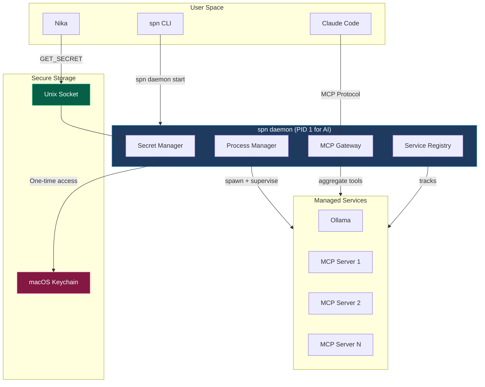
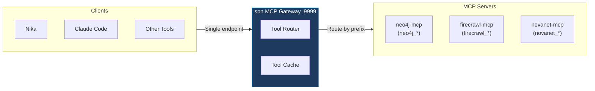
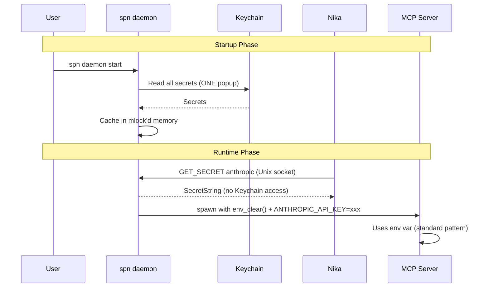

# spn Daemon Architecture: Unified AI Infrastructure Manager

**Version:** v0.9.0 (proposed)
**Date:** 2026-03-04
**Status:** Draft
**Authors:** Thibaut, Claude, Nika

---

## Executive Summary

This document proposes extending `spn` from a package manager into a **unified AI infrastructure orchestrator** that:

1. **Manages secrets** (single Keychain access point)
2. **Spawns and supervises** MCP servers and local models (Ollama)
3. **Aggregates MCP tools** into a single gateway endpoint
4. **Provides secure IPC** for Nika and other consumers

The core innovation is solving the **macOS Keychain popup problem** where multiple binaries with different signatures cannot share Keychain access. By making `spn daemon` the sole Keychain accessor, we eliminate repeated authentication prompts.

---

## Table of Contents

1. [Problem Statement](#problem-statement)
2. [Architecture Overview](#architecture-overview)
3. [Component Design](#component-design)
4. [Security Model](#security-model)
5. [Protocol Specification](#protocol-specification)
6. [Implementation Plan](#implementation-plan)
7. [Testing Strategy](#testing-strategy)
8. [Migration Path](#migration-path)

---

## Problem Statement

### Current Pain Points

```
┌─────────────────────────────────────────────────────────────────────────────────┐
│  CURRENT STATE: Fragmented Secret Management                                    │
├─────────────────────────────────────────────────────────────────────────────────┤
│                                                                                 │
│  ┌─────────────┐     ┌─────────────┐     ┌─────────────┐                        │
│  │     spn     │     │    Nika     │     │ MCP Server  │                        │
│  │  (keyring)  │     │ (config.toml)│    │  (env var)  │                        │
│  └──────┬──────┘     └──────┬──────┘     └──────┬──────┘                        │
│         │                   │                   │                               │
│         ▼                   ▼                   ▼                               │
│  ┌─────────────────────────────────────────────────────────────────────────┐   │
│  │                      macOS Keychain                                     │   │
│  │   ⚠️ Different binaries = different signatures = popup EVERY TIME       │   │
│  │   ⚠️ "Always Allow" grayed out for non-matching signatures              │   │
│  └─────────────────────────────────────────────────────────────────────────┘   │
│                                                                                 │
│  PROBLEMS:                                                                      │
│  1. Nika stores API keys separately in ~/.config/nika/config.toml (duplicate)  │
│  2. Each binary accessing Keychain triggers popup (UX nightmare)               │
│  3. MCP servers need env vars manually configured                              │
│  4. No unified process management (Ollama, MCP servers)                        │
│                                                                                 │
└─────────────────────────────────────────────────────────────────────────────────┘
```

### Root Cause Analysis

| Issue | Cause | Impact |
|-------|-------|--------|
| Keychain popups | Different binary signatures | UX degradation, user frustration |
| Secret duplication | Each tool manages own secrets | Inconsistency, security risk |
| Manual MCP setup | No central orchestration | Complex configuration |
| No process supervision | Each tool runs independently | Resource waste, no health checks |

---

## Architecture Overview

### Target State



### Key Design Decisions

| Decision | Rationale |
|----------|-----------|
| Single daemon process | One Keychain accessor = one popup |
| Unix socket IPC | Secure, fast, no env var exposure |
| Env injection for MCP | Third-party code expects env vars |
| Process supervision | Health checks, auto-restart, resource limits |

---

## Component Design

### 1. Secret Manager (`src/daemon/secrets.rs`)

**Responsibility:** Sole interface to OS Keychain, serves secrets via IPC.

```rust
/// Secret Manager - runs inside spn daemon
pub struct SecretManager {
    /// Cached secrets (mlock'd memory)
    cache: Arc<RwLock<FxHashMap<String, LockedString>>>,
    /// Keyring interface
    keyring: SpnKeyring,
}

impl SecretManager {
    /// Load all secrets at daemon startup (triggers one Keychain popup)
    pub async fn preload_all(&self) -> Result<()> {
        for provider in SUPPORTED_PROVIDERS {
            if let Ok(secret) = self.keyring.get(provider) {
                let locked = LockedString::new(secret)?;
                self.cache.write().await.insert(provider.to_string(), locked);
            }
        }
        Ok(())
    }

    /// Get secret for IPC request (no Keychain access, from cache)
    pub fn get_cached(&self, provider: &str) -> Option<SecretString> {
        self.cache.read().map(|c| c.get(provider).map(|s| s.to_secret()))
    }

    /// Build env vars for child process
    pub fn build_env_for_process(&self, needed: &[&str]) -> FxHashMap<String, String> {
        let mut env = FxHashMap::default();
        for provider in needed {
            if let Some(secret) = self.get_cached(provider) {
                let var_name = provider_env_var(provider);
                env.insert(var_name, secret.expose_secret().to_string());
            }
        }
        env
    }
}
```

**Memory Protection:**

```
┌─────────────────────────────────────────────────────────────────────────────────┐
│  SECRET MEMORY PROTECTION                                                       │
├─────────────────────────────────────────────────────────────────────────────────┤
│                                                                                 │
│  ┌─────────────────┐                                                            │
│  │  LockedString   │◄── mlock() prevents swap to disk                          │
│  │  (in cache)     │◄── MADV_DONTDUMP excludes from core dumps                 │
│  └────────┬────────┘◄── Zeroize on drop                                        │
│           │                                                                     │
│           ▼                                                                     │
│  ┌─────────────────┐                                                            │
│  │  SecretString   │◄── No Debug/Display exposure                              │
│  │  (for IPC)      │◄── ExposeSecret() required for access                     │
│  └─────────────────┘                                                            │
│                                                                                 │
└─────────────────────────────────────────────────────────────────────────────────┘
```

### 2. Process Manager (`src/daemon/process.rs`)

**Responsibility:** Spawn, supervise, and terminate managed services.

```rust
/// Process Manager - daemon's service supervisor
pub struct ProcessManager {
    /// Active processes
    processes: Arc<RwLock<FxHashMap<String, ManagedProcess>>>,
    /// Secret manager for env injection
    secrets: Arc<SecretManager>,
}

pub struct ManagedProcess {
    pub id: String,
    pub kind: ProcessKind,
    pub child: Child,
    pub started_at: Instant,
    pub config: ProcessConfig,
}

pub enum ProcessKind {
    Ollama,
    McpServer { name: String },
    Custom { command: String },
}

impl ProcessManager {
    /// Spawn a process with secure env injection
    pub async fn spawn(&self, config: ProcessConfig) -> Result<String> {
        // 1. Clear inherited env
        let mut cmd = Command::new(&config.command);
        cmd.env_clear();

        // 2. Inject only necessary secrets
        let env_vars = self.secrets.build_env_for_process(&config.required_secrets);
        cmd.envs(env_vars);

        // 3. Add non-secret env vars
        cmd.envs(&config.env);

        // 4. Configure stdio
        cmd.stdout(Stdio::piped());
        cmd.stderr(Stdio::piped());

        // 5. Spawn
        let child = cmd.spawn()?;
        let id = generate_process_id();

        // 6. Register
        self.processes.write().await.insert(id.clone(), ManagedProcess {
            id: id.clone(),
            kind: config.kind,
            child,
            started_at: Instant::now(),
            config,
        });

        Ok(id)
    }

    /// Health check loop
    pub async fn supervise(&self) {
        loop {
            tokio::time::sleep(Duration::from_secs(5)).await;
            let mut procs = self.processes.write().await;

            for (id, proc) in procs.iter_mut() {
                match proc.child.try_wait() {
                    Ok(Some(status)) => {
                        // Process exited - restart if configured
                        if proc.config.auto_restart {
                            // Re-spawn logic
                        }
                    }
                    Ok(None) => { /* Still running */ }
                    Err(e) => { /* Error checking */ }
                }
            }
        }
    }
}
```

### 3. MCP Gateway (`src/daemon/gateway.rs`)

**Responsibility:** Aggregate multiple MCP servers into single endpoint.



```rust
/// MCP Gateway - aggregates multiple servers
pub struct McpGateway {
    /// Route: tool_name -> server_endpoint
    routes: Arc<RwLock<FxHashMap<String, String>>>,
    /// Connected MCP servers
    servers: Arc<RwLock<FxHashMap<String, McpConnection>>>,
}

impl McpGateway {
    /// Handle tool call by routing to appropriate server
    pub async fn call_tool(&self, name: &str, args: Value) -> Result<Value> {
        // Find server that provides this tool
        let endpoint = self.routes.read().await
            .get(name)
            .ok_or(Error::ToolNotFound(name.to_string()))?
            .clone();

        // Forward request
        let conn = self.servers.read().await.get(&endpoint).unwrap();
        conn.call_tool(name, args).await
    }

    /// Refresh tool list from all connected servers
    pub async fn refresh_tools(&self) -> Result<Vec<Tool>> {
        let mut all_tools = Vec::new();

        for (endpoint, conn) in self.servers.read().await.iter() {
            let tools = conn.list_tools().await?;
            for tool in tools {
                self.routes.write().await.insert(tool.name.clone(), endpoint.clone());
                all_tools.push(tool);
            }
        }

        Ok(all_tools)
    }
}
```

### 4. Service Registry (`src/daemon/registry.rs`)

**Responsibility:** Track running services, endpoints, health status.

```rust
/// Service Registry - tracks all managed services
pub struct ServiceRegistry {
    services: Arc<RwLock<FxHashMap<String, ServiceEntry>>>,
}

pub struct ServiceEntry {
    pub id: String,
    pub name: String,
    pub kind: ServiceKind,
    pub endpoint: Option<String>,  // e.g., "http://localhost:11434"
    pub status: ServiceStatus,
    pub started_at: Option<Instant>,
    pub tools: Vec<String>,  // For MCP servers
}

pub enum ServiceKind {
    LlmServer,      // Ollama, vLLM
    McpServer,      // Any MCP server
    Gateway,        // Our MCP gateway
}

pub enum ServiceStatus {
    Starting,
    Running,
    Stopped,
    Failed(String),
}
```

---

## Security Model

### Threat Model

| Threat | Mitigation |
|--------|------------|
| Secret in env var visible via `ps` | `env_clear()` + selective injection |
| Secret swapped to disk | `mlock()` on secret memory |
| Secret in core dump | `MADV_DONTDUMP` on Linux |
| Unauthorized IPC access | Unix socket permissions (0600) |
| Process escape | No shell expansion, direct exec |

### Secret Flow



### Unix Socket Security

```
┌─────────────────────────────────────────────────────────────────────────────────┐
│  UNIX SOCKET IPC SECURITY                                                       │
├─────────────────────────────────────────────────────────────────────────────────┤
│                                                                                 │
│  Socket Path: ~/.spn/daemon.sock                                                │
│  Permissions: 0600 (owner read/write only)                                      │
│                                                                                 │
│  Authentication:                                                                │
│  1. Socket file permissions (only user can connect)                             │
│  2. Optional: Client sends token (for multi-user scenarios)                     │
│                                                                                 │
│  Message Format:                                                                │
│  ┌──────────────────────────────────────────────────────────────────────────┐  │
│  │  [4 bytes: length] [JSON payload]                                        │  │
│  │                                                                          │  │
│  │  Request:  { "cmd": "GET_SECRET", "provider": "anthropic" }              │  │
│  │  Response: { "ok": true, "secret": "sk-ant-..." }                        │  │
│  │            { "ok": false, "error": "NotFound" }                          │  │
│  └──────────────────────────────────────────────────────────────────────────┘  │
│                                                                                 │
└─────────────────────────────────────────────────────────────────────────────────┘
```

---

## Protocol Specification

### IPC Commands

| Command | Request | Response | Description |
|---------|---------|----------|-------------|
| `PING` | `{}` | `{"ok": true, "version": "0.9.0"}` | Health check |
| `GET_SECRET` | `{"provider": "anthropic"}` | `{"ok": true, "secret": "..."}` | Get secret |
| `LIST_SECRETS` | `{}` | `{"ok": true, "providers": ["anthropic", ...]}` | List available |
| `LIST_SERVICES` | `{}` | `{"ok": true, "services": [...]}` | List running services |
| `START_SERVICE` | `{"name": "ollama"}` | `{"ok": true, "id": "..."}` | Start service |
| `STOP_SERVICE` | `{"id": "..."}` | `{"ok": true}` | Stop service |
| `GET_GATEWAY` | `{}` | `{"ok": true, "endpoint": "..."}` | Get MCP gateway endpoint |

### Rust Client Library

```rust
// In Nika: use spn_client to communicate with daemon

use spn_client::SpnDaemonClient;

#[tokio::main]
async fn main() -> Result<()> {
    let client = SpnDaemonClient::connect().await?;

    // Get secret (no Keychain popup!)
    let secret = client.get_secret("anthropic").await?;

    // Use with rig-core
    let provider = rig::providers::anthropic::Client::new(&secret);

    Ok(())
}
```

---

## Implementation Plan

### Phase 1: Core Daemon (v0.9.0)

**Duration:** 1-2 weeks

| Task | Files | Complexity |
|------|-------|------------|
| Daemon scaffold | `src/daemon/mod.rs` | Low |
| Secret Manager | `src/daemon/secrets.rs` | Medium |
| Unix socket server | `src/daemon/ipc.rs` | Medium |
| CLI commands | `src/commands/daemon.rs` | Low |
| Integration tests | `tests/daemon_tests.rs` | Medium |

**Deliverables:**
- `spn daemon start/stop/status`
- Secret caching with mlock
- IPC via Unix socket
- Basic client library

### Phase 2: Process Manager (v0.10.0)

**Duration:** 1-2 weeks

| Task | Files | Complexity |
|------|-------|------------|
| Process spawn/kill | `src/daemon/process.rs` | Medium |
| Health supervision | `src/daemon/supervisor.rs` | Medium |
| Service registry | `src/daemon/registry.rs` | Low |
| Ollama integration | `src/daemon/services/ollama.rs` | Low |
| MCP server spawn | `src/daemon/services/mcp.rs` | Medium |

**Deliverables:**
- `spn service start/stop/list`
- Ollama management
- MCP server management with env injection
- Auto-restart on crash

### Phase 3: MCP Gateway (v0.11.0)

**Duration:** 2-3 weeks

| Task | Files | Complexity |
|------|-------|------------|
| MCP protocol impl | `src/daemon/mcp/protocol.rs` | High |
| Gateway router | `src/daemon/gateway.rs` | High |
| Tool aggregation | `src/daemon/mcp/aggregator.rs` | Medium |
| HTTP/SSE transport | `src/daemon/mcp/transport.rs` | Medium |

**Deliverables:**
- Single MCP endpoint for all servers
- Tool routing by name/prefix
- Automatic tool discovery

### Phase 4: Nika Integration (v0.12.0)

**Duration:** 1 week

| Task | Location | Complexity |
|------|----------|------------|
| Remove Nika secret storage | `nika/src/config.rs` | Low |
| Add spn_client dependency | `nika/Cargo.toml` | Low |
| Use daemon for secrets | `nika/src/provider/` | Medium |
| Use gateway for MCP | `nika/src/mcp/` | Medium |

**Deliverables:**
- Nika uses spn daemon exclusively
- No more config.toml secrets
- Single MCP connection to gateway

---

## Testing Strategy

### Unit Tests

```rust
#[cfg(test)]
mod tests {
    use super::*;

    #[tokio::test]
    async fn test_secret_manager_cache() {
        let manager = SecretManager::new_test();
        manager.set_cached("anthropic", "sk-test").await;

        let secret = manager.get_cached("anthropic").unwrap();
        assert_eq!(secret.expose_secret(), "sk-test");
    }

    #[tokio::test]
    async fn test_env_clear_injection() {
        let pm = ProcessManager::new_test();
        let config = ProcessConfig {
            command: "printenv".to_string(),
            required_secrets: vec!["anthropic"],
            ..Default::default()
        };

        // Verify only required vars are injected
        let output = pm.spawn_and_wait(config).await.unwrap();
        assert!(output.contains("ANTHROPIC_API_KEY"));
        assert!(!output.contains("HOME")); // Inherited vars cleared
    }
}
```

### Integration Tests

```rust
#[tokio::test]
async fn test_full_daemon_workflow() {
    // Start daemon in test mode
    let daemon = TestDaemon::start().await;

    // Connect client
    let client = SpnDaemonClient::connect_to(&daemon.socket_path).await.unwrap();

    // Test secret flow
    client.set_secret("test-provider", "test-secret").await.unwrap();
    let secret = client.get_secret("test-provider").await.unwrap();
    assert_eq!(secret.expose_secret(), "test-secret");

    // Test service spawn
    let id = client.start_service("echo-server").await.unwrap();
    let services = client.list_services().await.unwrap();
    assert!(services.iter().any(|s| s.id == id));

    daemon.shutdown().await;
}
```

### Security Tests

```rust
#[test]
fn test_secret_not_in_debug() {
    let secret = LockedString::new("sensitive".to_string()).unwrap();
    let debug = format!("{:?}", secret);
    assert!(!debug.contains("sensitive"));
    assert!(debug.contains("[REDACTED]"));
}

#[test]
fn test_socket_permissions() {
    let path = "/tmp/test-daemon.sock";
    create_socket(path).unwrap();

    let metadata = std::fs::metadata(path).unwrap();
    let mode = metadata.permissions().mode();
    assert_eq!(mode & 0o777, 0o600);
}
```

---

## Migration Path

### For spn Users

```bash
# Before (v0.8.x)
spn provider set anthropic  # Stores in Keychain
export ANTHROPIC_API_KEY=$(spn provider get anthropic --unmask)

# After (v0.9.0+)
spn daemon start            # One-time Keychain access
spn service start neo4j-mcp # Auto-injects secrets
# That's it! Nika and others connect to daemon
```

### For Nika Users

```toml
# Before (~/.config/nika/config.toml)
[api_keys]
anthropic = "sk-ant-..."   # DELETE THIS

# After
# No secrets in config.toml
# Nika automatically connects to spn daemon
```

### Backward Compatibility

| Scenario | Behavior |
|----------|----------|
| Daemon not running | Nika falls back to env vars |
| Old Nika version | Uses existing config.toml |
| No spn installed | Nika works standalone |

---

## File Structure

```
src/
├── daemon/
│   ├── mod.rs              # Daemon entry point
│   ├── secrets.rs          # Secret Manager
│   ├── process.rs          # Process Manager
│   ├── supervisor.rs       # Health monitoring
│   ├── registry.rs         # Service Registry
│   ├── gateway.rs          # MCP Gateway
│   ├── ipc.rs              # Unix socket server
│   └── services/
│       ├── mod.rs
│       ├── ollama.rs       # Ollama integration
│       └── mcp.rs          # Generic MCP server
├── client/
│   ├── mod.rs              # Client library for Nika
│   └── protocol.rs         # IPC protocol types
└── commands/
    ├── daemon.rs           # spn daemon start/stop
    └── service.rs          # spn service start/stop
```

---

## Success Metrics

| Metric | Target | Measurement |
|--------|--------|-------------|
| Keychain popups | 1 per session | User reports |
| Secret duplication | 0 | Code audit |
| Process restart time | < 1s | Benchmark |
| IPC latency | < 1ms | Benchmark |
| Memory for 10 secrets | < 1MB | `ps aux` |

---

## Appendix A: CLI Commands

```bash
# Daemon lifecycle
spn daemon start [--foreground]   # Start daemon
spn daemon stop                   # Stop daemon
spn daemon status                 # Show status
spn daemon logs                   # Tail daemon logs

# Service management
spn service start <name>          # Start service (ollama, mcp-server-*)
spn service stop <id|name>        # Stop service
spn service list                  # List running services
spn service logs <id|name>        # Show service logs

# Gateway
spn gateway status                # Show gateway endpoint + tools
spn gateway tools                 # List all available MCP tools
```

---

## Appendix B: Configuration

```yaml
# ~/.spn/daemon.yaml
daemon:
  socket: ~/.spn/daemon.sock
  log_level: info
  pid_file: ~/.spn/daemon.pid

secrets:
  preload: [anthropic, openai, neo4j]  # Load at startup
  cache_ttl: 3600                       # Refresh interval

services:
  ollama:
    enabled: true
    auto_start: false
    port: 11434

  mcp_gateway:
    enabled: true
    port: 9999
    aggregate_from:
      - neo4j-mcp
      - firecrawl-mcp
      - novanet-mcp

process:
  health_check_interval: 5s
  auto_restart: true
  max_restart_attempts: 3
```

---

## Appendix C: Security Review Findings

### Critical Security Enhancements (P0 - Before v0.9.0)

#### 1. Add `SO_PEERCRED` Validation to Unix Socket

```rust
use std::os::unix::net::UnixStream;
use libc::{getsockopt, ucred, SOL_SOCKET, SO_PEERCRED};

fn verify_peer(stream: &UnixStream) -> Result<()> {
    let mut cred: ucred = unsafe { std::mem::zeroed() };
    let mut len = std::mem::size_of::<ucred>() as libc::socklen_t;

    let fd = stream.as_raw_fd();
    let result = unsafe {
        getsockopt(fd, SOL_SOCKET, SO_PEERCRED,
                   &mut cred as *mut _ as *mut libc::c_void, &mut len)
    };

    if result != 0 || cred.uid != unsafe { libc::getuid() } {
        return Err(Error::UnauthorizedPeer);
    }
    Ok(())
}
```

#### 2. Socket Path Security

```rust
fn safe_bind(path: &Path) -> Result<UnixListener> {
    let parent = path.parent().ok_or(Error::InvalidPath)?;
    let meta = parent.metadata()?;

    #[cfg(unix)]
    {
        use std::os::unix::fs::MetadataExt;
        // Parent must be owned by current user
        if meta.uid() != unsafe { libc::getuid() } {
            return Err(Error::UnsafeSocketPath("parent not owned by user"));
        }
        // Parent must not be world-writable
        if meta.mode() & 0o077 != 0 {
            return Err(Error::UnsafeSocketPath("parent has unsafe permissions"));
        }
    }

    let _ = std::fs::remove_file(path); // Remove stale socket
    let listener = UnixListener::bind(path)?;
    std::fs::set_permissions(path, std::fs::Permissions::from_mode(0o600))?;

    Ok(listener)
}
```

### High Priority Enhancements (P1 - v0.9.1)

#### 3. Prevent `/proc/PID/environ` Exposure on Linux

```rust
// Add to spawn_process() after fork
#[cfg(target_os = "linux")]
unsafe fn secure_child_process() {
    // Prevent core dumps
    libc::prctl(libc::PR_SET_DUMPABLE, 0);
}
```

#### 4. macOS Core Dump Mitigation

```rust
#[cfg(target_os = "macos")]
fn disable_core_dumps() {
    use libc::{setrlimit, rlimit, RLIMIT_CORE};
    let limit = rlimit { rlim_cur: 0, rlim_max: 0 };
    unsafe { setrlimit(RLIMIT_CORE, &limit) };
}
```

#### 5. Log mlock Failures

```rust
impl LockedString {
    pub fn new(s: String) -> Result<Self> {
        let result = Self::try_lock(&s);
        if !result.locked {
            tracing::warn!(
                "mlock failed - secrets may be swapped to disk. \
                 Consider: ulimit -l unlimited"
            );
        }
        Ok(result)
    }
}
```

### Architecture Review Findings

| Aspect | Score | Required Actions |
|--------|-------|------------------|
| Architecture | 8/10 | Add ConfigManager, graceful shutdown |
| Security | 7/10 | SO_PEERCRED, socket path validation |
| Completeness | 7/10 | Add logging, metrics, signals |
| Rust Patterns | 8/10 | DaemonError type, Builder pattern |
| Integration | 9/10 | Create spn-client crate |

### Missing Components to Add

1. **Signal Handling:**
```rust
use tokio::signal::unix::{signal, SignalKind};

async fn handle_signals(shutdown_tx: broadcast::Sender<()>) {
    let mut sigterm = signal(SignalKind::terminate()).unwrap();
    let mut sigint = signal(SignalKind::interrupt()).unwrap();

    tokio::select! {
        _ = sigterm.recv() => { tracing::info!("SIGTERM received"); }
        _ = sigint.recv() => { tracing::info!("SIGINT received"); }
    }

    let _ = shutdown_tx.send(());
}
```

2. **PID File Locking:**
```rust
fn create_pid_file(path: &Path) -> Result<File> {
    let file = OpenOptions::new()
        .write(true)
        .create(true)
        .open(path)?;

    // Exclusive lock - fails if another daemon holds it
    flock(file.as_raw_fd(), FlockArg::LockExclusiveNonblock)?;
    file.write_all(std::process::id().to_string().as_bytes())?;
    Ok(file)
}
```

3. **DaemonError Type:**
```rust
#[derive(Error, Debug)]
pub enum DaemonError {
    #[error("daemon already running")]
    AlreadyRunning,
    #[error("socket error: {0}")]
    Socket(#[from] std::io::Error),
    #[error("keychain error: {0}")]
    Keychain(#[from] keyring::Error),
    #[error("unauthorized peer")]
    UnauthorizedPeer,
    #[error("unsafe socket path: {0}")]
    UnsafeSocketPath(&'static str),
}
```

### Security Summary

| Threat | Mitigation | Status |
|--------|------------|--------|
| Keychain popups | Single binary access | ✅ Designed |
| Socket hijacking | SO_PEERCRED + path check | ⚠️ To implement |
| `/proc/environ` leak | PR_SET_DUMPABLE | ⚠️ To implement |
| Core dump secrets | RLIMIT_CORE=0 | ⚠️ To implement |
| Memory swap | mlock + zeroize | ✅ Exists |

---

## Appendix D: spn-client Crate (Minimal Dependency)

```toml
# spn-client/Cargo.toml
[package]
name = "spn-client"
version = "0.1.0"

[dependencies]
tokio = { version = "1", features = ["net", "io-util"] }
serde = { version = "1", features = ["derive"] }
serde_json = "1"
secrecy = "0.10"
thiserror = "2"
# No keyring, no clap, no reqwest - minimal for Nika
```

```rust
// spn-client/src/lib.rs
pub struct SpnDaemonClient {
    stream: UnixStream,
}

impl SpnDaemonClient {
    pub async fn connect() -> Result<Self> {
        let path = dirs::home_dir()
            .ok_or(Error::NoHomeDir)?
            .join(".spn/daemon.sock");

        let stream = UnixStream::connect(&path).await?;
        Ok(Self { stream })
    }

    pub async fn get_secret(&mut self, provider: &str) -> Result<SecretString> {
        self.send(&Request::GetSecret { provider: provider.to_string() }).await?;
        let response: Response = self.recv().await?;
        response.into_secret()
    }
}
```

---

## References

- [Tokio UnixListener](https://docs.rs/tokio/latest/tokio/net/struct.UnixListener.html)
- [keyring crate](https://docs.rs/keyring/3.6.3)
- [MCP Protocol Spec](https://modelcontextprotocol.io)
- [spn secrets module](../src/secrets/mod.rs)
- [CVE-2025-24204](https://nvd.nist.gov/vuln/detail/CVE-2025-24204) - macOS Keychain vulnerability
- [SO_PEERCRED](https://man7.org/linux/man-pages/man7/unix.7.html) - Unix socket peer credentials
